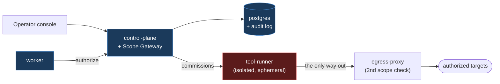

<div align="center">

# ASM Scanner with Agent Capability

**An AI plans the security assessment. It never runs anything the deterministic Scope Gateway hasn't independently authorized.**

[](.github/workflows/ci.yml)
[](control-plane/)
[](frontend/)
[](LICENSE)
[-blue)](docs/roadmap.md)

</div>

---

Point an LLM at "find and test vulnerabilities on this domain" and you've
also handed it the ability to touch things it was never authorized to
touch — one hallucinated hostname, or one webpage that manages to talk the
model into something it shouldn't do, is all it takes. This project keeps
the two jobs strictly apart: the model reasons about what to look at next
and proposes actions, but nothing executes until a separate, deterministic
layer — the **Scope Gateway** — checks it against an explicit, time-boxed
scope and either allows it or doesn't. The model can suggest anything. It
can never do anything the gateway hasn't independently authorized.

Around that boundary sits a full external-assessment pipeline — passive
reconnaissance, fingerprinting, vulnerability correlation, and controlled,
non-destructive active testing by an AI "Agent" — for anyone running
real, authorized security work (your own systems, a bug bounty program,
client engagements) who wants AI's speed without handing it the keys.

> [!IMPORTANT]
> **Guiding principle:** the language model **plans and proposes** — a
> deterministic control layer (the **Scope Gateway**) **decides and
> executes**. Control is enforced technically, not through prompt wording.

The binding functional/legal specification lives in
[`docs/spec/`](docs/spec/) (seven documents). The developer-facing writeup
with diagrams is in **[`docs/`](docs/)**.

## Contents

- [Architecture at a glance](#architecture-at-a-glance)
- [Quick start](#quick-start)
- [Project structure](#project-structure)
- [Documentation](#documentation)
- [Legal](#legal)

## Architecture at a glance

Two security zones that never share a container, privileges, or network
access. Every active tool call passes through the Scope Gateway; the only
way out runs through the egress proxy.



Details: [docs/architecture.md](docs/architecture.md) ·
[docs/security-model.md](docs/security-model.md)


## Quick start

Use this path for a local evaluation on a machine with Docker Engine, Docker
Compose v2, Git, Make, Node.js 20, and curl. From the repository root:

```bash
cp .env.example .env
make up
curl --fail http://localhost:8000/health
```

The health request should return `{"status":"ok"}`. The API is available at
<http://localhost:8000> and its interactive documentation at
<http://localhost:8000/docs>.

To use the operator console, open a second terminal:

```bash
cd frontend
npm ci
npm run dev
```

Then open <http://localhost:5173>. An LLM provider is optional; without one,
the agent phase is skipped. Configure one later in **Settings** or in `.env`.
The runner used for authorized active scans is intentionally not started by
the basic evaluation command.

For the complete beginning-to-end guide—including active scanning, a
single-host production installation with HTTPS, account bootstrap,
verification, troubleshooting, upgrades, backups, and safe shutdown—follow
**[INSTALL.md](INSTALL.md)**. Run `make help` to see the available project
commands.

## Project structure

| Directory | Role | Zone |
|---|---|---|
| [`control-plane/`](control-plane/) | FastAPI orchestrator + Scope Gateway; sole DB writer | control plane |
| [`worker/`](worker/) | Celery; orchestrates scan phases, executes nothing itself | control plane |
| [`egress-proxy/`](egress-proxy/) | network-level scope enforcement (2nd check) | bridge |
| [`tool-runner/`](tool-runner/) | HexStrike + Kali tools, ephemeral per engagement | execution plane |
| [`frontend/`](frontend/) | operator console (React/TS) | client |
| `lab/` | isolated test environment + test loop (not yet in the public release) | test |
| [`deployment/k8s/`](deployment/k8s/) | Job + NetworkPolicy, for tenant-isolated deployments | — |
| [`docs/`](docs/) | technical documentation (diagrams) | — |

## Documentation

| Page | Content |
|---|---|
| [architecture.md](docs/architecture.md) | layers, zones, data flow, pipeline |
| [security-model.md](docs/security-model.md) | gateway, defense in depth, audit, threat model |
| [data-model.md](docs/data-model.md) | entities, ER diagram, scope resolution, scoring |
| [api.md](docs/api.md) | REST/SSE contracts |
| [INSTALL.md](INSTALL.md) | Install, run in Compose or Kubernetes, hardening |
| [testing.md](docs/testing.md) | test concept, lab test loop, positive/negative/regression |
| [roadmap.md](docs/roadmap.md) | maturity path + implementation status |
| [legal.md](docs/legal.md) | ⚖ legal prerequisites |

## Legal

> [!WARNING]
> Actively scanning third-party systems without authorization can be a
> criminal offense in many jurisdictions. Before the first scan: a signed
> engagement, proof of ownership, a test window, professional liability
> insurance, employer approval for secondary employment. Details:
> [docs/legal.md](docs/legal.md) and
> [`docs/spec/rules-of-engagement.md`](docs/spec/rules-of-engagement.md).
> This repository is not legal advice.

## Contributing & security

Conventions in [CONTRIBUTING.md](CONTRIBUTING.md). **Do not** report
security vulnerabilities publicly — see [SECURITY.md](SECURITY.md).

## License

Copyright (C) 2026 Johannes Hettig. Licensed under the
[GNU Affero General Public License v3.0](LICENSE) — if you run a modified
version of this software as a network service, you must make your source
changes available to its users (AGPL-3.0 §13).
