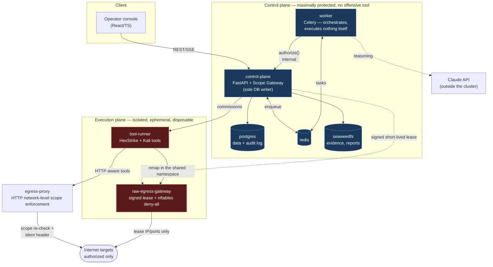
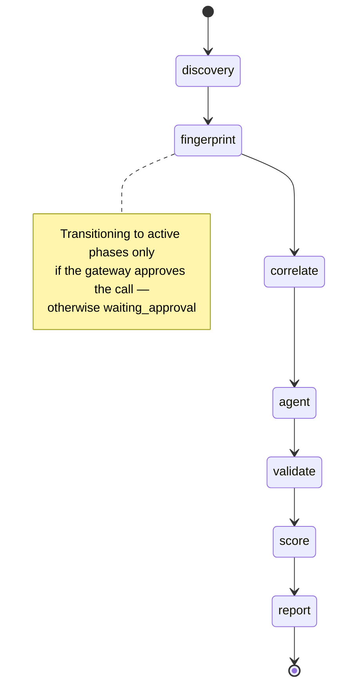

# Architecture

Source: [`docs/spec/technical-architecture.md`](spec/technical-architecture.md)
(v2.1) and [`docs/spec/scanner-specification.md`](spec/scanner-specification.md) (v1.0).

## Overview

The scanner covers every phase of an external security assessment — from
passive reconnaissance to controlled, non-destructive exploitation testing
(the "Vector Agent"). Target context: a side-business managed service for
SMBs. The value creation lies in **interpreting and prioritizing** the
results, not in the scan itself.

## Components and zones

Two security zones that never share a container, privileges, or network
access (Deployment Architecture Ch. 1):

**Core rule:** no layer with active components executes directly. Every
active tool call passes through the Scope Gateway (details:
[security-model.md](security-model.md)).

## Layer model (data flow)

| # | Layer | Function | Character |
|---|---|---|---|
| A | Engagement & scope management | Signed scope, authorized assets, time window, tool profile | controlling |
| B | **Scope Gateway** | Checks every tool call; blocks everything outside it; approval workflow | deterministic |
| C | Discovery | Subdomains (CT logs), DNS/RDAP, ASN/IP, cloud assets | passive |
| D | Fingerprinting | Port/service detection, HTTP headers, TLS, tech stack | passive → active |
| E | Vulnerability correlation | Version→CVE (NVD), EPSS, misconfig checks | passive/active |
| F | Vector Agent (LLM) | Proposes vulnerability hypotheses & safe test steps | proposing |
| G | Safe active checks | Executes authorized, non-destructive checks | active |
| H | Risk scoring | EPSS + CVSS + business context + exposure | processing |
| I | Orchestration & history | Scheduler, diff detection, asset inventory | processing |
| J | Reporting | Plain-language customer report (the sales product) | output |
| K | Audit trail | Complete logging of every action & approval | cross-cutting |

## Scan-phase pipeline

A state machine per `scan_run` (Technical Architecture Ch. 4.1), resumable:

Implemented in [`worker/app/tasks/`](../worker/app/tasks/): `pipeline.py`
drives the machine, each phase is its own module. Per-phase maturity is
tracked in [roadmap.md](roadmap.md).

## Technology stack (reference)

| Layer | Technology | Rationale |
|---|---|---|
| API / orchestrator | Python 3.12 + FastAPI | async, typed, fast tool integration |
| Task queue | Celery + Redis | distributed, repeatable scan jobs |
| Primary DB | PostgreSQL 16 | relational + JSONB for flexible findings |
| Tool execution | MCP server + HexStrike | controlled tool registry per engagement |
| LLM (reasoning) | Claude (tool use) | reliable structured tool use |
| Object storage | S3-compatible (SeaweedFS) | raw output, report PDFs, evidence |
| Secrets | Vault / SOPS | scope signing key, API keys |
| Frontend | React + TypeScript | component-based, type-safe |

The stack is a reference implementation — swappable as long as the
contracts ([api.md](api.md)) are honored.
