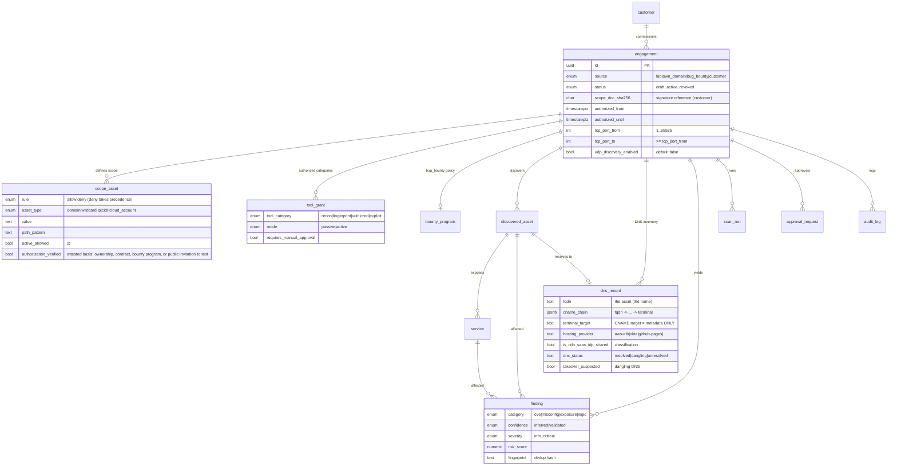

# Data Model

Source: [Technical Architecture Ch. 2](spec/technical-architecture.md#2-data-model). Schema:
[`control-plane/migrations/0001_init_schema.sql`](../control-plane/migrations/0001_init_schema.sql),
ORM models: [`control-plane/app/models/`](../control-plane/app/models/).
All IDs are UUIDv7 (time-sortable).

## ER diagram



`dns_record` is **passive inventory metadata** (REQ-DNS-001..003): it
describes how an in-scope FQDN resolves. Important for scope safety: the
stored CNAME target (e.g. an ELB or Okta address) **never** becomes a
`discovered_asset` and **never** gets materialized into `resolved_host` —
only the original name is the asset. `takeover_suspected` flags dangling DNS
(a CNAME pointing at a non-resolving target) purely at the DNS level;
confirmation is done by a human — the scanner never queries the third-party
target itself.

## The legal basis: `engagement.source`

`source` deterministically drives the authorization source, the rules, and
the report recipient:

| `source` | Authorization source | Gateway/runner special case | Report |
|---|---|---|---|
| `lab` | isolated environment | no egress restriction needed; all tools free | internal/none |
| `own_domain` | an authorization attestation per active asset (`scope_asset.authorization_verified`) — the basis can be ownership, a contract, or a public invitation to test | full active testing on authorized assets | internal |
| `bug_bounty` | program policy (platform + program reference) | deny precedence, `max_rps`, AI/automation gate, optional ident header | bounty submission |
| `customer` | signed engagement (`scope_doc_sha256`) | scope signature + approval workflow | customer PDF |

## Nmap scan envelope

Migration `0010_engagement_nmap_envelope.sql` stores the operator-authorized
Nmap envelope on `engagement`: one inclusive TCP range and an explicit bounded
UDP opt-in. Equal TCP bounds mean one port; defaults preserve `1-65535`. Database
checks, Pydantic validation, and draft-only API updates prevent invalid or
post-activation widening. Raw leases read these values from the database and
carry the exact protocol/ports into the gateway; worker arguments are not an
authority source. The UDP port set itself is fixed by REQ-SCAN-011 rather than
stored as arbitrary user input.

## Scope resolution (allow/deny)

The gateway computes, for every target, whether it lies in scope. **`deny`
always takes precedence** — including via wildcard or path. Matching logic:
[`authorize.py::_matches_asset_value`](../control-plane/app/gateway/authorize.py).

| `asset_type` | Example `value` | Matches |
|---|---|---|
| `domain` | `api.customer.com` | exactly `api.customer.com` |
| `wildcard` | `*.customer.com` | `sub.customer.com` (fnmatch) |
| `ip` | `10.0.0.5` | exactly this IP |
| `cidr` | `10.0.0.0/24` | any IP in the network |

REQ-SCOPEVAL-001/002: `value` is format-validated and canonicalized at
creation time (`ip`/`cidr` via `ipaddress`, host bits cleared; IPv6
explicitly rejected - not yet supported end-to-end). A `cidr` value's
address count is capped by `Settings.max_host_discovery_addresses`
(default 65536, a /16 for IPv4).

## Findings: `confidence` and fingerprint

- `inferred` = derived from a version/banner (passive, possibly a false
  positive).
- `validated` = confirmed via non-destructive active proof.

Only `validated` findings with evidence carry full weight into customer
reporting — the "no alarm without proof" principle.

The stable fingerprint deduplicates across tools and runs
([`internal.py::_fingerprint`](../control-plane/app/api/internal.py)):

```
fingerprint = sha256(asset|port|category|norm_title|cve_ids)
```

The diff against the last run yields `NEW` / `RESOLVED` / `PERSIST` for
trend reporting.

## Risk score

EPSS-dominated with KEV as a hard override
([`scoring/risk_score.py`](../control-plane/app/scoring/risk_score.py)):

```
risk_score = 100 * (0.35*epss + 0.20*cvss/10 + 0.20*exposure
                    + 0.15*business + 0.10*validated)
# KEV override: if the CVE is in CISA KEV -> severity = critical
```

| `severity` | `risk_score` | SLA recommendation |
|---|---|---|
| critical | ≥ 85 or KEV | immediate / < 24 h |
| high | 70–84 | < 7 days |
| medium | 40–69 | < 30 days |
| low | 15–39 | planned |
| info | < 15 | for awareness |

> CVSS measures only severity, not likelihood. A CVSS 9.8 with no public
> exploit is often less urgent than a CVSS 7 on the CISA KEV list. That's
> why EPSS dominates and KEV forces a hard raise.

### Cancellation reconciliation

Migration `0009_finalize_cancelled_scan_runs.sql` is an idempotent data
reconciliation for runs stopped under the former cooperative-only behavior. It
turns only `cancel_requested=true` rows still in `running`/`waiting_approval`
into terminal `aborted` rows, sets the operator-cancel reason/finish time, and
closes approvals whose stored tool-call JSON carries that exact run ID.

### Run liveness & reaping (`scan_run.heartbeat_at`)

`scan_run.heartbeat_at` (migration `0011`) is a liveness signal the worker
refreshes while a run makes progress — on every phase/state update and, during
long raw-egress operations (a multi-minute Nmap), via a dedicated heartbeat call.
Before a new run is created (and on operator `POST /scan`), the control plane
**reaps** any `running`/`waiting_approval` run for that engagement whose
`heartbeat_at` is older than `stale_run_seconds` (default 300s): it becomes
`aborted` with `state_reason='reaped_stale_heartbeat'`. This keeps a crashed or
hung worker from permanently blocking new scans, and — together with the
self-healing raw-egress lease (dead-heartbeat reclamation + idempotent release in
the gateway) — makes the single-slot raw Nmap lifecycle crash-consistent. See
`docs/requirements/raw-egress-lease-stability.md` (REQ-RAWLEASE-001..003).
