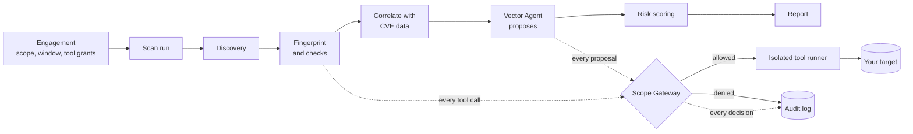
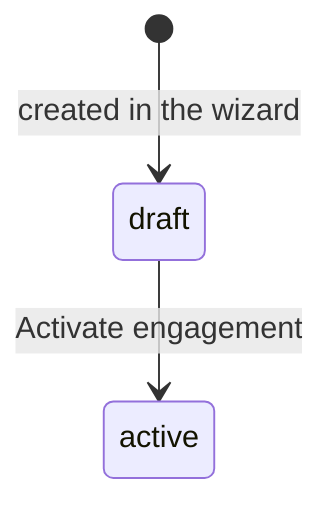

# Concepts

**Who this is for:** everyone who uses Axial. Read it once before your first scan; every screen and guide builds on these ideas.
**After this page you can:** explain in a sentence what an engagement, a scope, a scan run, the Scope Gateway and a finding are, and say why an AI agent cannot cause an out-of-scope action.

<!-- ui-labels: Vector Agent | Lens Agent | Diff -->

## How the pieces fit

Read it from the left: an *engagement* defines what is allowed, a *scan run* works through the phases, and **every** request to a target passes the *Scope Gateway* first. What it decides, and the fact that it decided, goes into the audit log.

## Engagement

One authorised assignment: *what* you may test (the scope), *when* (the test window), and with *which kinds of tools* (the tool grants). Everything else, the runs, the findings, the reports and the audit trail, belongs to one engagement.

An engagement starts as a **draft** and becomes **active** when you activate it:

Only an **active** engagement can scan, and only inside its test window. Outside the window every tool call is denied, so a scan is blocked before it starts. The statuses `awaiting_signature`, `paused`, `completed` and `revoked` are defined and respected where they matter (a `completed` or `revoked` engagement can no longer change its tool grants), but this version has no screen that sets them. Each engagement belongs to the operator who created it; see [Roles and ownership](#roles-and-ownership).

## Scope

The scope is a list of rows, each of which *allows* or *denies* a target: a domain, a wildcard, an IP address, an IP range (CIDR) or a cloud account. Two rules matter more than any others:

- **Deny always wins.** A deny row beats any allow row that also matches.
- **Nothing is allowed by default.** A target that no allow row matches is out of scope and receives nothing.

An allow row for a domain also covers its subdomains. Each row can additionally carry a port range that narrows the engagement's overall port ceiling for that one target, never widens it. See [Define an engagement and its scope](guides/define-an-engagement.md).

## Scan run

One execution of the pipeline. An engagement can have many runs over time, and a new run never replaces the old ones.

| Phase | What happens | Touches targets? |
|---|---|---|
| Discovery | Finds hosts and subdomains from public records and, for IP ranges, a bounded liveness sweep | public records only, plus the sweep |
| Fingerprint | Finds open ports, classifies each service, plans the checks, runs them | yes |
| Correlate | Looks up the services found in public vulnerability data (CVE, exploit-probability and known-exploited lists) | no |
| Vector Agent | An AI model proposes further checks; each one is authorised or denied by the Scope Gateway | only what the gateway allows |
| Score | Calculates a risk score and severity for each finding | no |
| Report | Prepares the data for the PDF | no |

A run can be stopped at any time. Its state is `running`, or `waiting_approval` while it waits for you, for example to approve a request, and it ends as `done`, `failed` or `aborted`.

## Scope Gateway

A deterministic check that authorises every tool call, every time, before anything is sent. It checks the scope, the test window, the tool grants, the tool allow-list, the safety of the arguments, the rate limit and the run's budget. A call that fails any check is denied and the reason is recorded. It is the safety boundary: nothing runs without it, and configuration can tune what it allows but never go around it. The developer-level description is in [`docs/security-model.md`](../security-model.md).

## Vector Agent

An AI model that **proposes** the next check. It never executes anything itself: every proposal goes through the Scope Gateway like any other call. That is why a badly worded or manipulated prompt cannot cause an out-of-scope action. It also means the agent's instructions are safe to edit. The agent is off by default and is switched on per engagement; it needs an AI provider (see [Configure the AI provider](guides/configure-the-llm.md)). If it cannot complete a step it says so, and the deterministic results stay available.

## Lens Agent

An AI model that **explains** an existing finding in plain language: what it is, what it could mean for you and how to fix it. It only reads the evidence that was recorded; it sends nothing to your systems.

## Tool grants and approvals

Three separate controls decide whether a tool can run on an engagement:

1. **Tool grants** authorise a *category* of tools (recon, fingerprint, vuln, cred, exploit), passive and/or active.
2. **Tool switches** turn a single tool on or off, globally in Settings or for one campaign.
3. **Approval** makes every call of a tool wait for a person.

A switch can only narrow what the grants allow; it can never create a grant. [Control which tools run](guides/control-which-tools-run.md) explains the order of the checks and how to use each.

## Findings

A finding is one problem on one target, with evidence. Findings belong to the engagement as a whole and are **de-duplicated** by a fingerprint: scanning again updates the finding you already have rather than creating a second one. What changed between two runs is shown as a **Diff**: newly seen, no longer seen, still present.

Each finding has a status you set: open, accepted risk, false positive or resolved. Your decision survives later scans. A resolved finding that appears again is reopened automatically, because that is a regression. See [Triage findings](guides/triage-findings.md).

## Risk score and severity

Axial calculates its own score from 0 to 100. It is not a single named industry standard. It blends real industry signals with context about your situation:

| Signal | Weight |
|---|---|
| Exploitation probability (EPSS) | 35 % |
| CVSS base score | 20 % |
| Exposure of the target | 20 % |
| Business context | 15 % |
| Confidence: validated versus inferred | 10 % |
| Listed as known-exploited (CISA KEV) | overrides to critical |

The severity is a threshold on that score: **critical** from 85, **high** from 70, **medium** from 40, **low** from 15, and **info** below. A severity that a tool or the agent asserted explicitly, for example for a confirmed exposure of personal data, is kept when the finding is scored again and keeps the number consistent with that severity, even when there is no CVE or EPSS data to score from.

## Confidence: validated or inferred

Every finding records what its conclusion rests on:

- **Validated** means the weakness was *demonstrated*: a tool matched a template, or the Vector Agent observed it directly, for example by requesting an endpoint without logging in and getting protected data back.
- **Inferred** means it was *reasoned* from a version banner, a product name or context, without an observation that proves it on this target.

Only a validated finding may carry its reporter's own severity. An inferred one is scored by the platform instead, so a speculative claim cannot present itself as critical. The agent must declare the basis of every finding it reports; a missing or unrecognised declaration always falls back to inferred.

## Authenticated scanning

Most real applications keep their interesting functions behind a login, so a scan that never logs in under-reports risk while looking clean. Where credentials are supplied, or the target allows open self-registration, the Vector Agent can log in, and the session is then carried automatically across its later requests to that same host for the rest of the run. A session is never replayed to a different host, never stored and never outlives the run, and the login request itself still goes through the normal approval flow. If the agent cannot log in, it is told to report everything behind the login as *untested* rather than clean.

## Audit log

Every gateway decision, every network request, every state change and every agent event is written to an append-only log. Each row contains a hash of the previous row, so a change, a removal or a re-ordering afterwards is detectable. The log is the evidence for the customer, a bug-bounty operator or an insurer that every action was inside the scope and when it was approved. See [Audit](reference/audit.md).

## Roles and ownership

There are two roles. An **operator** creates and runs engagements. An **admin** also manages users, can reassign ownership, and configures the AI provider and the global tool policy. There is no shared password and no public sign-up; see [Users and two-factor authentication](guides/users-and-mfa.md).

Every engagement has exactly one **owner**, the person who created it (an administrator can hand it to someone else). **Everyone who is signed in can read every engagement** in the installation: its scope, findings and evidence, runs, reports and audit log. **Only the owner, or an administrator, can change it**: edit it, activate it, start or stop a scan, change tools, triage findings, ask for a report or an explanation, and decide a tool-call approval. Someone else who tries gets a refusal (`403`), and nothing changes. The queue of pending approvals is the owner's own: nobody else sees it. An engagement you may read but not change shows a notice that names its owner, so you know whom to ask. Global settings, the AI provider and user management are not part of any engagement and stay with administrators.

This is the only boundary inside an installation. There are no separate tenants: if two organisations must not see each other's engagements, run two installations.
