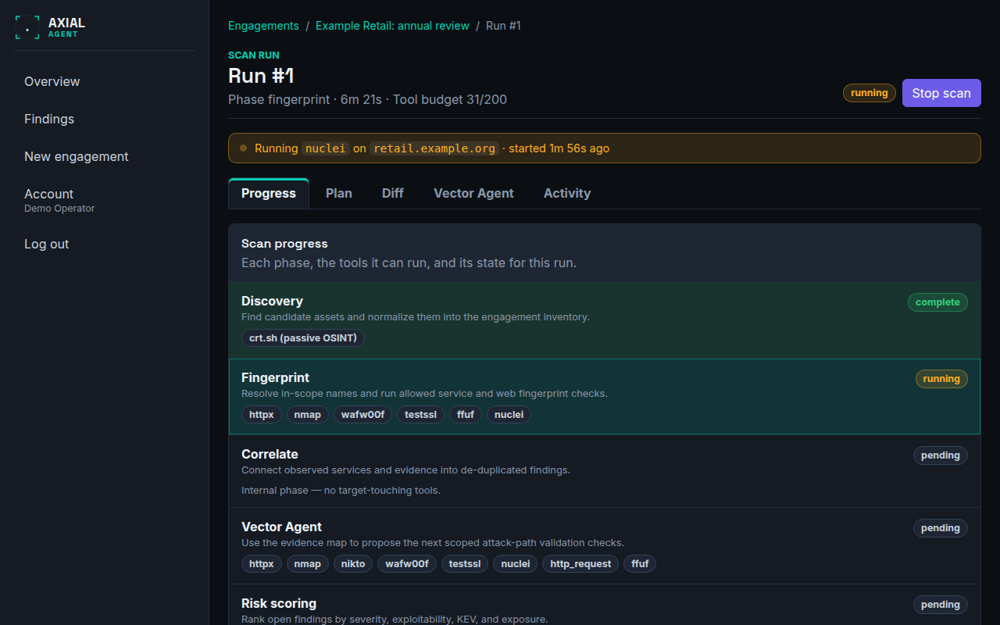

# Start and watch a scan

**Who this is for:** operators running scans.
**After this page you can:** start a run, tell what it is doing at any moment, deal with the two things that can pause it, stop it, and understand how it ended.

<!-- ui-labels: Start run | Scan readiness | Progress | Plan | Diff | Vector Agent | Activity | Stop scan | Stop requested | Review discovered assets | Continue with selected | Approval required — state-changing request | A run is already active | Open active run → | reduced coverage | partial coverage -->

## Before you start

On the engagement page, the panel above the tabs and the **Scan readiness** item tell you whether a run can start. All of these must be true:

- the engagement is **active**;
- you are inside its test window;
- at least one active allow row exists;
- at least one tool category is granted for **active** testing;
- for a bug-bounty engagement, its program policy is filled in.

If one is missing, the panel says *This engagement cannot scan yet* and lists each reason as a sentence, with a link where there is one. Every message is explained in [Troubleshooting](../troubleshooting.md#scan-readiness-messages).

## Start the run

Choose **Start run**. Only one run per engagement can be active at a time: while one is going, the button reads **A run is already active** and a link, **Open active run →**, opens it. The run starts in the background and appears at the top of the runs table on the **Runs & reports** tab; click it to open the run.

## Watch it

The **Run detail** screen has five tabs. Start with these:

- **Progress** shows the phases (discovery, fingerprint, correlate, agent, score, report) and where the run is. A banner at the top says which tool is running on which target and for how long.
- **Plan** shows each open port that was found, the checks planned for it and the state of each: *running*, *complete*, *partial*, *failed* or *skipped*, with the reason. It fills in once the scan knows what is open, and updates as it goes.
- **Activity** is the human-readable account of what each tool did, grouped by phase.
- **Vector Agent** lists the agent's steps, if the agent is on.
- **Diff** compares with the previous run.

Everything is described in the [Run detail reference](../reference/run-detail.md). A small web site typically takes 10 to 20 minutes; a thorough scan, many hosts or a large range take much longer. The deep content discovery of **Thorough** alone is about 25 minutes per web service.

## What can pause a run

A run stops and waits for you in two cases only. Both are popups that appear wherever you are in the console.

1. **A request needs your approval.** Anything that could change data on the target, and any tool you marked for approval, never runs on its own. The run shows `waiting_approval` until you decide, or until the approval timeout (15 minutes by default) rejects it. See [Approve or deny a tool call](approve-or-deny-a-tool-call.md).
2. **An asset review.** If the engagement has **Pause after discovery for manual asset review** on, the run stops after discovery and asks you to confirm the hosts. See [Run detail](../reference/run-detail.md#asset-review).

Nothing else needs you. If the run seems quiet, look at the banner and the **Activity** tab; some checks, such as a large template run, take many minutes and have their own time budget.

## Stop it

Choose **Stop scan**. The run is marked `aborted` at once, pending approvals are closed, and only that run's tool processes are terminated. Other runs and other engagements are not touched. The button then reads **Stop requested**. The findings that were found before the stop are kept.

## How it ends

| State | Meaning |
|---|---|
| `done` | all phases finished. Read the warnings below before you call it clean |
| `aborted` | stopped by you, or stopped by the system for a stated reason |
| `failed` | an internal error ended it; the reason names the error and the phase |

A `done` run can still carry a warning pill next to its state:

- **reduced coverage**: a tool the scan depends on (the port scanner, or the web probe that gates the web checks) was attempted but never once succeeded. The result is **not** a clean bill of health.
- **partial coverage**: at least one check stopped at its time limit before it finished. What it reported is real, but a short list does not mean the surface is clean.

The reason a run stopped is shown beside the state. [Troubleshooting](../troubleshooting.md#why-a-run-stopped) explains each one and what to do. In general, if a scan stopped for a reason that is not yours, start it again.

## If the system restarts

A run does not have to start over when the worker is lost (a deploy, a crash, a reboot). After a few minutes without a sign of life, the system resumes the same run on its own, at most twice, and continues after the last phase that finished; within the fingerprint phase it continues with the checks that were not finished, and the ones that were complete are not run again. A phase that was interrupted starts from its beginning, so its own requests are sent again. If it cannot be resumed it is aborted with the reason `reaped_stale_heartbeat`.

## Limits that apply to every run

- A **tool budget**: the number of tool calls a run may make (200 by default). It is shown in the run's heading. Calls beyond it are denied (`budget_exhausted`).
- An **agent iteration budget** (50 by default): the round-trips the Vector Agent may make. See [Configure the AI provider](configure-the-llm.md).
- A **time budget per check**, at most 30 minutes, enforced by the tool runner. A check cut off by it is *partial*.
- The **rate limit** of the installation and, for a bug-bounty engagement, the program's own cap.

When the run is done, go to the **Findings** tab; see [Triage findings](triage-findings.md).
