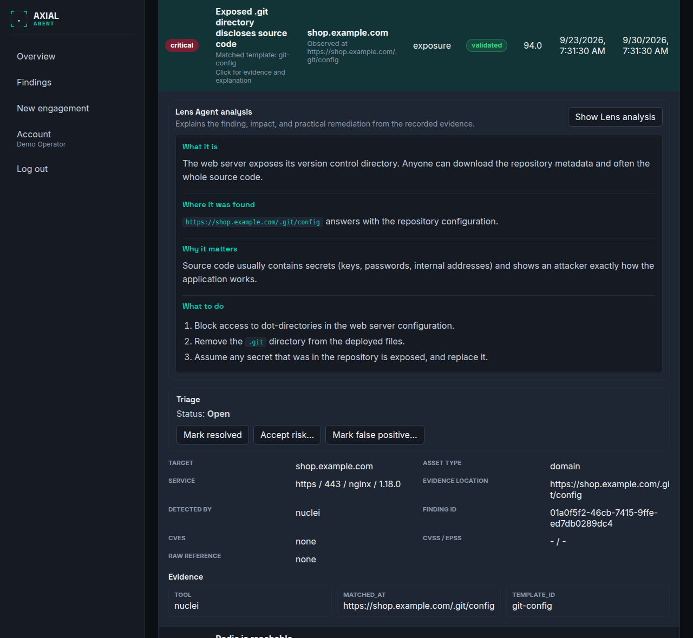

# Triage findings

**Who this is for:** operators working through what a scan found.
**After this page you can:** read a finding and its evidence, get a plain-language explanation, give every finding a status with a reason, and know how your decisions behave in later scans and in the report.

<!-- ui-labels: Findings | Open | Accepted risk | False positive | Resolved | All severities | Triage | Mark resolved | Accept risk… | Mark false positive… | Reopen | Lens Agent analysis | Explain with Lens Agent | Show Lens analysis | Evidence | Open in engagement → | Click for evidence and explanation | Click for evidence, explanation, and triage -->

## Where findings are

- On an engagement: the **Findings** tab, which opens first. It lists the engagement's findings, accumulated and de-duplicated across all its runs.
- Across engagements: **Findings** in the navigation, which lists findings from every engagement you can see, most severe first. See [Overview and All findings](../reference/overview.md).

Both have one tab per status, **Open**, **Accepted risk**, **False positive** and **Resolved**, each with its count, and a severity filter (**All severities**, or one severity). On **Open**, each severity shows how many open findings it has. The tab and an open finding are part of the page address, so you can link a colleague straight to one.

## Read a finding

Click a row (**Click for evidence and explanation**) to expand it. You see:

| Field | Meaning |
|---|---|
| Severity and score | the 0 to 100 risk score and the severity it maps to; see [Concepts](../concepts.md#risk-score-and-severity) |
| Confidence | **validated** (the weakness was demonstrated) or **inferred** (reasoned from a banner or context). Treat inferred findings as leads to confirm |
| **Target**, **Asset type**, **Service** | where it was found |
| **Evidence location** and **Detected by** | which tool, and where the proof is |
| **CVEs** and **CVSS / EPSS** | the public vulnerability data, where there is any |
| **Raw reference** and **Finding ID** | identifiers for tickets and audits |
| **Evidence** | the recorded proof: the fields the tool returned, with secret values redacted. If none was attached it says so |

*Found on*, *First seen* and *Last seen* tell you whether this is new or has been there since the first scan.

## Get an explanation

Choose **Explain with Lens Agent** (it needs an AI provider; see [Configure the AI provider](configure-the-llm.md)). The **Lens Agent analysis** explains in plain language what the finding is, what it could mean for you and how to fix it, using only the evidence that was recorded. Once generated it is kept; **Show Lens analysis** shows it again. If the provider cut the answer off, the page says so and some sections may be missing. A report includes an explanation only if one was already generated, so explain the findings you want in the report *before* you generate it; see [Reports](reports.md).

## Decide what to do

Under **Triage**, choose one:

| Action | Status | Reason required? | Use it when |
|---|---|---|---|
| **Mark resolved** | Resolved | no | it has been fixed |
| **Accept risk…** | Accepted risk | **yes** | it is real and you decided to live with it |
| **Mark false positive…** | False positive | **yes** | the tool was wrong; nothing is there |
| **Reopen** | Open | no | you changed your mind, or it came back |

The two that ask *why* need a reason of at least 3 characters (up to 1,000), because a decision that removes a finding from the open list has to say why, and that reason is what a reader of the report sees. Write a real sentence. The finding then shows who changed its status, when, and the reason, and every change is written to the audit log.

## What happens in later scans

Findings are matched across scans by a fingerprint, so a finding is never duplicated. Your decision survives:

- An **accepted risk** or **false positive** that is seen again stays as you set it.
- A **resolved** finding that is seen again is **reopened automatically**: it is a regression, and you should know.
- A finding no longer seen is simply not observed in that run; see [Compare runs](compare-runs.md) for what that does and does not prove.

## In the report

Open findings are listed in full. **Accepted risks** get their own table with your justification. **False positives** are only counted, not listed. The risk overview shows what is new, what was resolved and what persists since the previous run.

## A sensible routine

1. Start with **Open**, most severe first.
2. For each: read the evidence, ask the Lens Agent if the cause is not obvious, then triage it.
3. Do not mark something *resolved* until a later run no longer sees it; rescan to confirm.
4. If a run showed **partial coverage** or **reduced coverage**, an empty or short list is not a finding that nothing is wrong. See [Troubleshooting](../troubleshooting.md#why-a-run-stopped).
