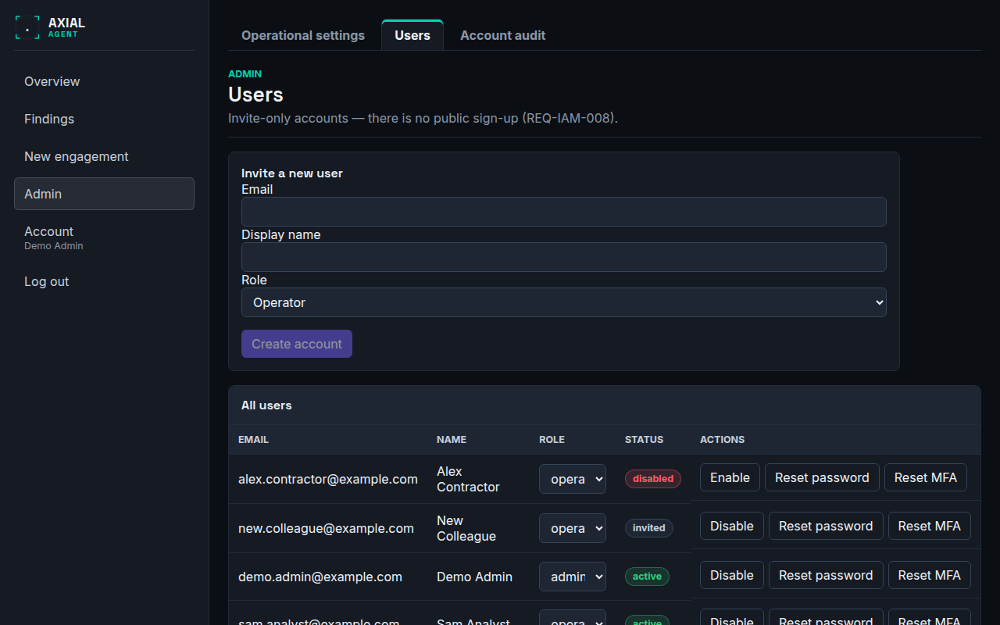

# Users and two-factor authentication

**Who this is for:** administrators who add people, and everyone who has to sign in or recover access.
**After this page you can:** create the first administrator, invite users, get a new user through their first sign-in, and recover from a lost password, a lost phone or a lock-out.

<!-- ui-labels: Admin | Users | Invite a new user | Email | Display name | Role | All users | Disable | Enable | Reset password | Reset MFA | Account | Change password | Re-enroll two-factor authentication | Active sessions | Revoke | Log out | Account audit -->

Axial uses individual accounts with mandatory two-factor authentication (a time-based code from an authenticator app). There is **no shared password and no public sign-up**: accounts are created by an administrator.

## Roles

| Role | Can |
|---|---|
| **operator** | create engagements and run scans; **reads** every engagement in the installation and **changes** only the ones they own |
| **admin** | everything an operator can, on **every** engagement; also manages users, the AI provider, the scan rate and the global tool policy under **Admin**, and reads the account audit |

See [Roles and ownership](../concepts.md#roles-and-ownership) for what reading and changing cover.

Keep the number of admins small. Give people the operator role unless they administer the installation.

## Create the first administrator

The very first account cannot be created from the console, deliberately: nothing reachable over the network can make "the first user an admin". Create it once from the command line, on the host:

```bash
INITIAL_ADMIN_EMAIL=you@example.com make bootstrap-admin
```

On a production host use `docker compose exec -e INITIAL_ADMIN_EMAIL=you@example.com control-plane python scripts/bootstrap_admin.py` as shown in [`INSTALL.md`](../../../INSTALL.md). It prints a one-time temporary password once. Run again with an existing address it does nothing.

## Invite a user



1. Open **Admin**, tab **Users**, section **Invite a new user**.
2. Enter their **Email**, **Display name** and **Role**, and create the account.
3. The page shows a **one-time temporary password**. It is not shown again. Give it to the person by a different route than the one that told them about the account (for example, a phone call or a password manager share).

## First sign-in (for the new user)

1. Sign in with the email and the temporary password.
2. Choose a new password of at least 12 characters.
3. Enrol an authenticator: scan the QR code with an authenticator app, or enter the secret by hand, then type the 6-digit code.
4. **Save the ten backup codes.** They are shown once and each works once.

Nothing else in the console is reachable until these steps are done. See the [account reference](../reference/account-and-admin.md).

## Recover access

| Situation | What to do |
|---|---|
| Forgot the password | An admin chooses **Reset password** for that user and passes on the new one-time password. The user signs in with it and sets a new one |
| Lost the phone, still has backup codes | Sign in with a backup code, then **Account → Re-enroll two-factor authentication** |
| Lost the phone, no backup codes | An admin chooses **Reset MFA**; the user enrols a new authenticator at the next sign-in. The admin does not need the user's password for either reset |
| Locked out after wrong passwords | wait: five wrong passwords lock the account for 30 seconds, doubling with each further failure up to 15 minutes |
| "Too many sign-in attempts from this address" | wait a few minutes; this limit is per source address and does not affect other people |
| The only admin is locked out | run the bootstrap command on the host to create another admin, or have the host's administrator reset the account on the server |

There is no self-service "forgot password" link in this version, because no email is sent by the system; recovery is by an administrator.

## Change your own password and authenticator

Under **Account**:

- **Change password**: enter the current one and a new one. Your other sessions are signed out.
- **Re-enroll two-factor authentication**: after you confirm your current password you get a new secret and new backup codes; the old ones stop working at once.
- **Active sessions** lists every device signed in as you with **Revoke** for each. Sessions end by themselves after 12 hours without activity, or 7 days in total.

## Disable or remove access

On **Admin → Users**, **Disable** an account to stop it signing in at once without losing its engagements and history, and **Enable** to restore it. You can change a role from the same list. Disabling is the right step when someone leaves.

An engagement belongs to the person who created it, and it always has an owner. Reassigning an engagement to another user is an administrator action through the API (`PUT /engagements/{id}/owner`, see [`docs/api.md`](../../api.md)); the console has no screen for it.

## What is recorded

Every sign-in, MFA event, password change, session and admin action is written to a tamper-evident account audit under **Admin → Account audit**. Passwords, codes and session tokens are never written to it.
