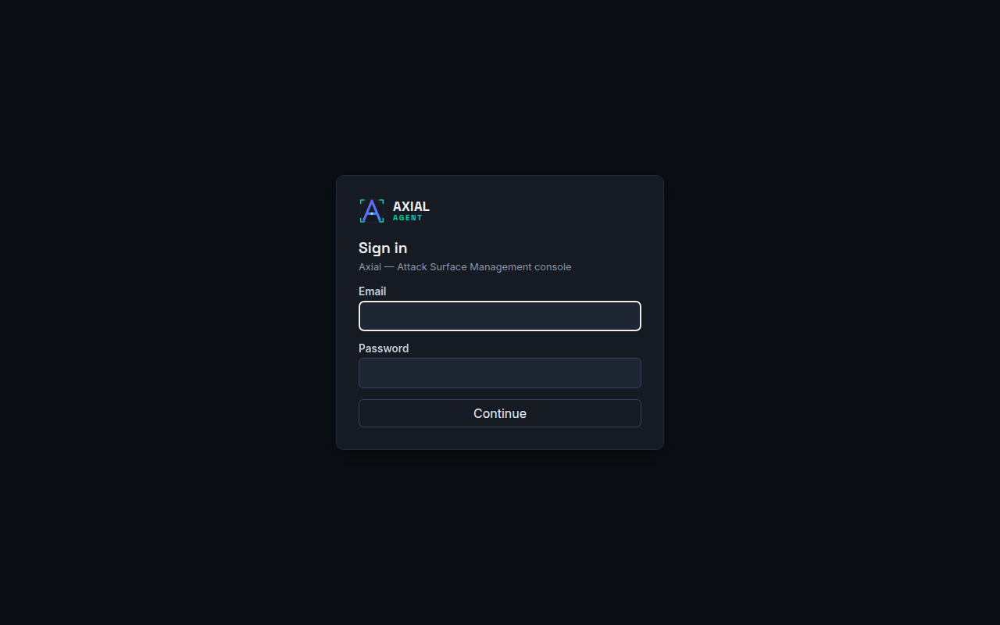
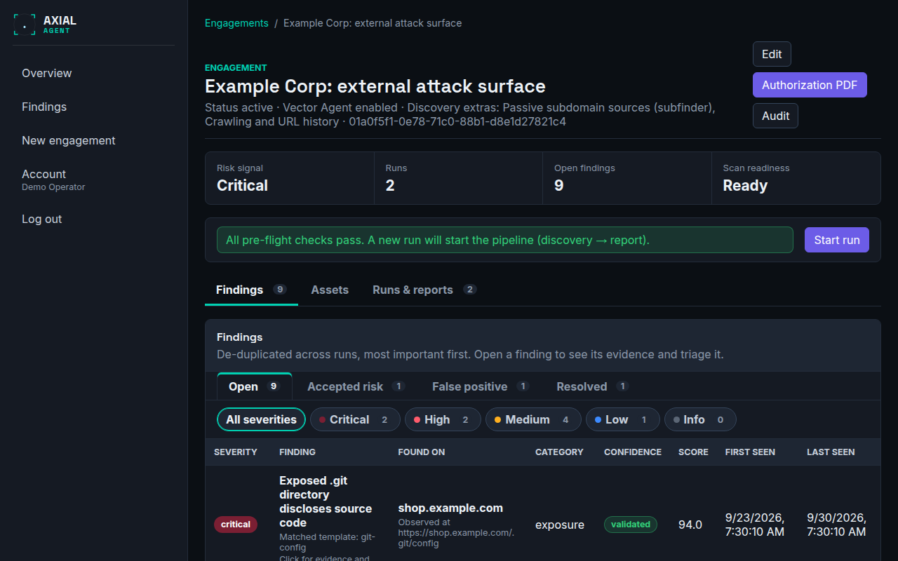

# Quickstart: from nothing to a first report

**Who this is for:** someone installing Axial on their own computer to try it, with a domain they own or have written permission to test.
**After this page you can:** sign in, define an engagement, run a scan, read the findings and download a PDF report. Plan on about 30 minutes, most of it waiting for the scan.

<!-- ui-labels: New engagement | Save draft and continue | Save scope and tools | Review authorization | Activate engagement | Start run | Generate report | Download PDF | Allow passive | Allow active | Require approval for these active tools | Mark resolved | Accept risk… | Mark false positive… | authorization attested -->

> **Only scan what you are allowed to scan.** Axial refuses anything outside the scope you enter, but you are responsible for the scope being right. If you have no target of your own, stop here and read [Safety, legal and limits](safety-legal-limits.md) first.

## 1. Install and start (about 10 minutes)

You need a 64-bit Linux host with Docker Engine and Docker Compose v2, Git, `make`, `curl` and Node.js 20, plus roughly 4 CPU cores, 8 GB of memory and 40 GB of free disk. The full list and the production setup are in [`INSTALL.md`](../../INSTALL.md); the short version for a local try-out:

```bash
cp .env.example .env
make up
docker compose --profile runner up -d --build
```

`make up` starts the control plane, database and queue. The second command adds the *runner*, the isolated part that actually runs the scanning tools; without it a scan has nothing to run with. Check that the backend answers:

```bash
curl --fail http://localhost:8000/health
```

You should see `{"status":"ok"}`. Then start the console in a second terminal and open <http://localhost:5173>:

```bash
cd frontend
npm ci
npm run dev
```

## 2. Create the first administrator

There is no public sign-up. The first account is created from the command line, once:

```bash
INITIAL_ADMIN_EMAIL=you@example.com make bootstrap-admin
```

It prints a one-time temporary password. Copy it; it is not shown again.

## 3. Sign in and set up two-factor authentication



1. Open the console and sign in with your email and the temporary password.
2. Choose a new password (at least 12 characters).
3. Scan the QR code with an authenticator app (Google Authenticator, 1Password, Authy or any TOTP app), or type the secret in by hand.
4. Enter the 6-digit code to confirm.
5. Save the ten backup codes somewhere safe. Each works once and they are the only way in if you lose the phone.

From now on every sign-in needs the password and a code. See [Users and two-factor authentication](guides/users-and-mfa.md).

## 4. Create an engagement

Choose **New engagement** in the navigation. The wizard has five steps:

1. **Window.** A title, who to call if a test causes problems, and the dates you are authorised to test. Leave the port range at its default. Choose **Save draft and continue**.
2. **Scope.** Enter your domain, for example `example.com`, in the first row, which is an *allow* row. Make sure **active** (the scan may send requests to it) and **authorization attested** (you confirm you may test it) are ticked.
3. **Tools.** Keep **Allow passive** for `recon` and **Allow active** for `fingerprint`, and also tick **Allow active** for `vuln`: without it the template-based vulnerability checks do not run. The wizard then pre-selects every `vuln` tool under **Require approval for these active tools**, which means each call of such a tool waits for your click. For a first scan of your own domain, untick them so the run is not interrupted; you can switch approval back on at any time (see [Control which tools run](guides/control-which-tools-run.md)). Choose **Save scope and tools**.
4. **Review.** Read the summary, then choose **Review authorization**.
5. **Authorize.** Download the authorization PDF if you need a signed record, then choose **Activate engagement**.

Details for each step are in [Define an engagement and its scope](guides/define-an-engagement.md) and [Authorize and activate](guides/authorize-and-activate.md).

## 5. Run a scan

On the engagement page, the panel above the tabs says whether the engagement is ready. If it is, choose **Start run**. If it is not, the panel lists exactly what is missing and links to the fix; [Troubleshooting](troubleshooting.md) explains each message.

A run opens in the **Run detail** screen. A small web site typically takes 10 to 20 minutes. While it runs you can watch the **Progress** tab, or the **Activity** tab for what each tool did. Nothing needs your attention unless a popup asks for approval: only requests that could change data on the target ever stop and ask. See [Start and watch a scan](guides/run-a-scan.md).

## 6. Read the findings



When the run is `done`, go back to the engagement. The **Findings** tab lists what was found, most severe first. Open a finding to see the evidence, ask the Lens Agent to explain it in plain language (needs an AI provider, see [Configure the AI provider](guides/configure-the-llm.md)), and decide what to do with it: **Mark resolved**, **Accept risk…** or **Mark false positive…**. See [Triage findings](guides/triage-findings.md).

An empty list is a result, but not always a clean one. A run can finish with a warning such as *partial coverage* or *reduced coverage*, meaning a tool stopped at its time limit or never succeeded. [Troubleshooting](troubleshooting.md) explains how to read that.

## 7. Get the report

On the **Runs & reports** tab choose **Generate report**, then **Download PDF**. The report contains an executive summary, the risk overview with the change since the previous run, the detailed findings, the asset inventory and a section recording what was authorised. See [Reports](guides/reports.md).

## Next

- Run the same engagement again later: findings are matched across runs, so the second report shows what is new and what was fixed. See [Compare runs](guides/compare-runs.md).
- Learn the ideas behind the screens in [Concepts](concepts.md).
- Switch on more discovery, or a deeper scan: [Tune a scan](guides/tune-a-scan.md).
