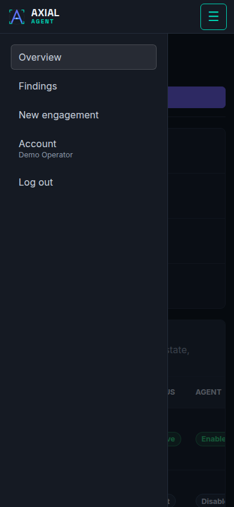

# Screen reference

**Who this is for:** operators and admins who want to know what a screen, a tab or a field does.
**After this page you can:** find the page that describes any screen of the console, and know which address opens it.

<!-- ui-labels: Overview | Findings | New engagement | Admin | Account | Log out | Manual | Page not found -->

The console has one navigation list: **Overview**, **Findings**, **New engagement**, **Admin** (admins only), **Account** and **Log out**. If the administrator built the console with the address of this manual, a **Manual** link also appears there; it opens the manual in a new tab, and without it there is no such link. On a phone or a narrow window the list folds into the menu button (☰) at the top right; it opens as a panel over the page and closes when you pick a page, press Escape or tap outside it. A popup that asks for approval appears on every page, not only on the run it belongs to.

## Screens

| Screen | What it is for | Page |
|---|---|---|
| Sign-in | Email, password and a code from your authenticator app | [Account, sign-in and administration](account-and-admin.md) |
| Overview | Every engagement with its status | [Overview and All findings](overview.md) |
| All findings | Every finding from every engagement you can see | [Overview and All findings](overview.md) |
| New engagement | The five-step wizard | [New engagement wizard](wizard.md) |
| Engagement detail | The hub of one engagement: readiness, findings, assets, runs and reports | [Engagement](engagement.md) |
| Edit engagement | Metadata, discovery extras, scan depth, tool grants and overrides, scope | [Engagement](engagement.md) |
| Run detail | Everything about one run | [Run detail](run-detail.md) |
| Audit | The full, searchable record of one engagement | [Audit](audit.md) |
| Account | Your password, two-factor authentication and sessions | [Account, sign-in and administration](account-and-admin.md) |
| Admin | *Admin.* Operational settings, users and the account audit | [Settings](settings.md) and [Account, sign-in and administration](account-and-admin.md) |

## Addresses

Every address the console answers, in one table. The parts written `:id` and `:runId` are the identifiers of an engagement and a run.

| Address | Opens | Page |
|---|---|---|
| `/login` | Sign-in | [Account, sign-in and administration](account-and-admin.md) |
| `/` | Overview | [Overview and All findings](overview.md) |
| `/findings` | All findings | [Overview and All findings](overview.md) |
| `/new` | New engagement wizard. `/new?draft=<id>` resumes a draft | [New engagement wizard](wizard.md) |
| `/account` | Account | [Account, sign-in and administration](account-and-admin.md) |
| `/admin` | Admin, with the tabs Operational settings, Users and Account audit | [Settings](settings.md) |
| `/engagements/:id` | Engagement detail | [Engagement](engagement.md) |
| `/engagements/:id/edit` | Edit engagement. `#tool-grants` jumps to the tool grants | [Engagement](engagement.md) |
| `/engagements/:id/runs/:runId` | Run detail | [Run detail](run-detail.md) |
| `/engagements/:id/audit` | Audit | [Audit](audit.md) |
| `/engagements/:id/live` and `/engagements/:id/results` | Old addresses; they open the engagement detail | [Engagement](engagement.md) |
| `/settings`, `/admin/users` and `/admin/audit` | Old addresses; they open Admin | [Settings](settings.md) |
| `/docs` | Nothing. The console no longer has a documentation page; the documentation is this manual, so the address shows **Page not found** | this manual |
| any other address | A page that says **Page not found** with a link back to the overview | |

The tab you have open on an engagement (`?tab=assets`), the filters of **All findings** and an open finding are part of the page address, so you can bookmark a view or send it to a colleague. They only see what they are allowed to see.
