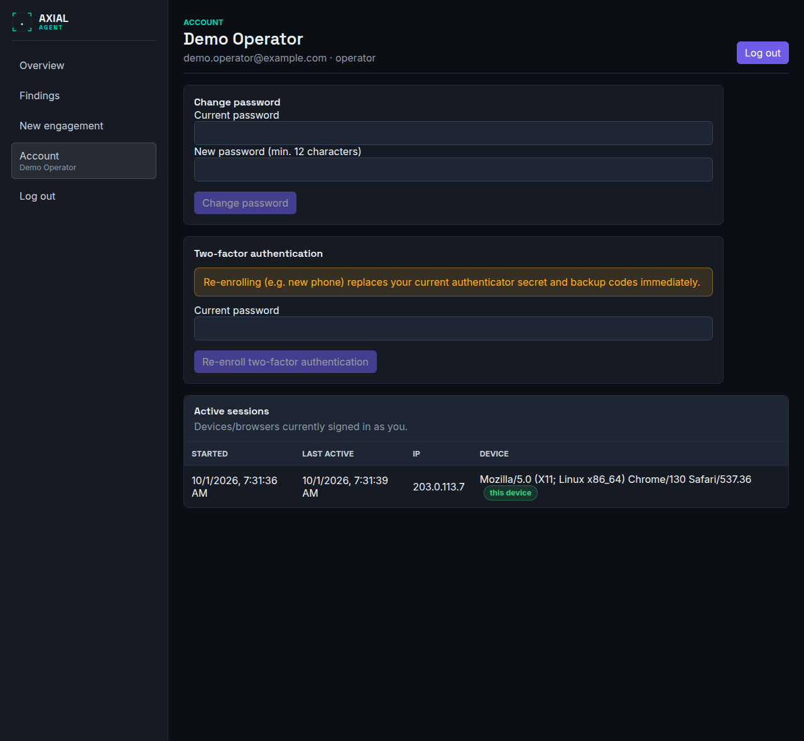
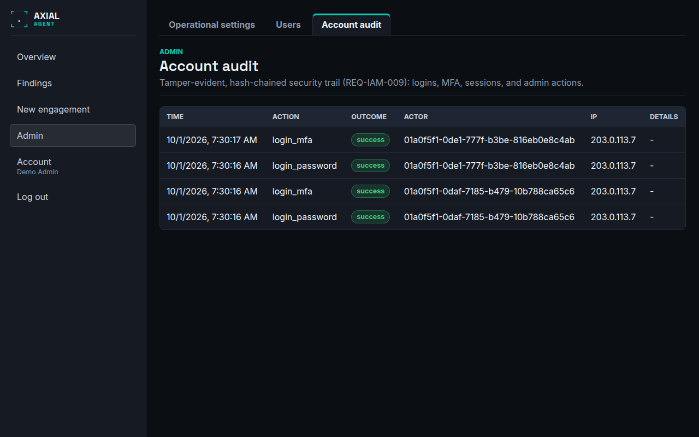

# Account, sign-in and administration

**Who this is for:** everyone who signs in; administrators for the last two sections.
**After this page you can:** sign in for the first time, manage your own password, authenticator and sessions, and, as an admin, invite users and read the account audit.

<!-- ui-labels: Sign in | Email | Password | Code | Set your password | New password (min. 12 characters) | Set up two-factor authentication | Can't scan? Enter manually: | Enter your authentication code | Save your backup codes | I've saved these codes — continue | Account | Change password | Current password | Two-factor authentication | Re-enroll two-factor authentication | Confirm | Cancel | Active sessions | Revoke | this device | Log out | Users | Invite a new user | Display name | Role | All users | Disable | Enable | Reset password | Reset MFA | Account audit -->

## Signing in (`/login`)

Individual accounts with mandatory two-factor authentication. There is no shared password and no public sign-up.

1. Enter your **Email** and **Password**.
2. Enter the 6-digit code from your authenticator app (Google Authenticator, 1Password, Authy or any TOTP app), or one of your one-time backup codes.

A session is never issued from a password alone. The session is held in a cookie that scripts on the page cannot read, and a change made with it has to come from the console itself.

### Your first sign-in

A new account starts with a one-time temporary password that an admin gave you.

1. Sign in with it. The page says *This is your first sign-in — replace the temporary password*; choose a **New password** of at least 12 characters (**Set your password**).
2. **Set up two-factor authentication:** scan the QR code, or use **Can't scan? Enter manually:**, then enter the 6-digit code.
3. **Save your backup codes.** Ten codes are shown **once**; each works once. They are the only way in if you lose your authenticator. Choose **I've saved these codes — continue**.

### When sign-in fails

Five wrong passwords in a row lock the account for a short time that grows with each further failure, from 30 seconds up to 15 minutes. A code is valid for five minutes and five attempts. Many attempts from one address are refused with *too many sign-in attempts from this address - try again later* for a few minutes (30 attempts in five minutes); this does not affect other addresses. Sessions end after 12 hours without activity or 7 days in total. If you cannot get in, ask an admin to reset your password or your two-factor authentication. See [Users and two-factor authentication](../guides/users-and-mfa.md).

## Account (`/account`)

- **Change password:** enter the **Current password** and a **New password**. Other sessions are signed out.
- **Two-factor authentication:** **Re-enroll two-factor authentication** (for example on a new phone) asks for your current password, then shows a new QR code. Confirm with a code. It replaces the old secret and the backup codes at once, so save the new ten codes.
- **Active sessions:** every device and browser signed in as you, with when it started, when it was last active and which device it is; yours is marked **this device**. **Revoke** signs one out.
- **Log out** is also in the navigation, one click from anywhere.

Each engagement belongs to the operator who created it. An operator sees and manages only their own engagements; an admin sees and manages all of them and can reassign ownership.

## Admin: Users (`/admin`, tab **Users**)

*Admin only.* Invite-only accounts: there is no public sign-up.

- **Invite a new user:** **Email**, **Display name** and **Role** (operator or admin). The account is created with a one-time temporary password that is shown **once**: pass it on by another route than the invitation.
- **All users:** a table of every account with its role and status. Change the role from the list, **Disable** or **Enable** an account, **Reset password** (shows a new one-time temporary password) and **Reset MFA** (the user enrols a new authenticator at the next sign-in, for example after a lost phone). You never need the user's own password for these.

The first administrator is created from the command line; see [Quickstart](../quickstart.md#2-create-the-first-administrator).

## Admin: Account audit (`/admin`, tab **Account audit**)

*Admin only.* A tamper-evident, hash-chained log of every sign-in, MFA event, password change, session and admin action, with **Time**, **Action**, **Outcome**, **Actor** and **Details**. It is separate from each engagement's [Audit](audit.md) trail. Passwords, codes and session tokens are never written to it.
