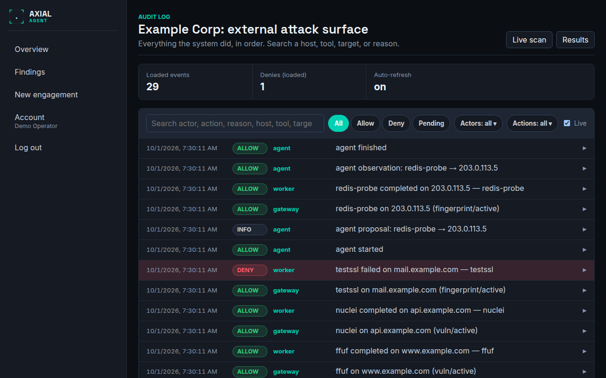

# Audit

**Who this is for:** operators, reviewers and auditors who need to see exactly what the system did and why.
**After this page you can:** search and filter the audit log of an engagement, read a denied decision, and know what the log does and does not prove.

<!-- ui-labels: Audit log | Loaded events | Denies (loaded) | Auto-refresh | Clear | Live | Load older events | Beginning of log. | Action | Actor | Reason | Payload | Live scan | Results -->

## The page (`/engagements/:id/audit`)

The complete, hash-chained trail of one engagement: every gateway decision, network request, state change and agent event, as one chronological, searchable log. Open it from the **Audit** link on the overview, the engagement page or the Edit page. The buttons **Live scan** and **Results** in its header lead back to the engagement.

### One log, in order

A single time-ordered list, newest first, of everything the system did. Each row is a plain-language line, *who did what, on which target, with which outcome*, with a coloured decision badge: allow, deny or pending. Above the list, counters show the **Loaded events** and the **Denies (loaded)** among them.

### Search

The search box matches anywhere in the record: the actor, the action, the reason and inside the event's data. Type a hostname, a tool name, a target or a scan-run id to see just those events.

### Filters

Narrow the list by decision (All, Allow, Deny, Pending), by **Actor** (the gateway, the agent, the egress proxy, the worker, a user) and by **Action**. **Clear** removes all filters. **Load older events** pages back through the full history, and **Beginning of log.** tells you that you have reached the start. The **Live** checkbox turns **Auto-refresh** on or off: while it is on, the page tails new events as long as you are at the top. It pauses by itself once you page into the history, so new events never open a gap above the older ones you have loaded.

### Details and overrides

Expand any row for the raw actor, action, reason and **Payload**. A denied gateway decision shows a plain-language explanation of the reason (what was missing, and where to fix it) and, where it applies, a one-click **operator override** that adds what the denial was missing: the scope row, the active-allowed flag, the tool grant, or the Vector Agent switch. An override is a deliberate widening of what the engagement may do, and it is itself written to this log (action `gateway_override`). Some denials, such as unsafe arguments, offer no override, because they need a code change rather than a decision.

The meaning of each denial reason is in [Troubleshooting](../troubleshooting.md#why-the-scope-gateway-denied-a-call).

## What the log proves

The log is **append-only and hash-chained**: each row carries a hash that includes the previous row, so a modified, removed, inserted or re-ordered row breaks the chain and can be detected. That is what makes it usable as evidence towards a customer, a bug-bounty operator or an insurer that every action was within the scope and when it was approved. Filtering and searching are read-only; they never alter the log.

The log of one engagement is the full record. The *Activity* tab of a run is a filtered, run-scoped, human-readable view of the same events; see [Run detail](run-detail.md#activity). Account events (sign-ins, password changes, admin actions) are in a separate chain, the account audit, which only administrators can read.
