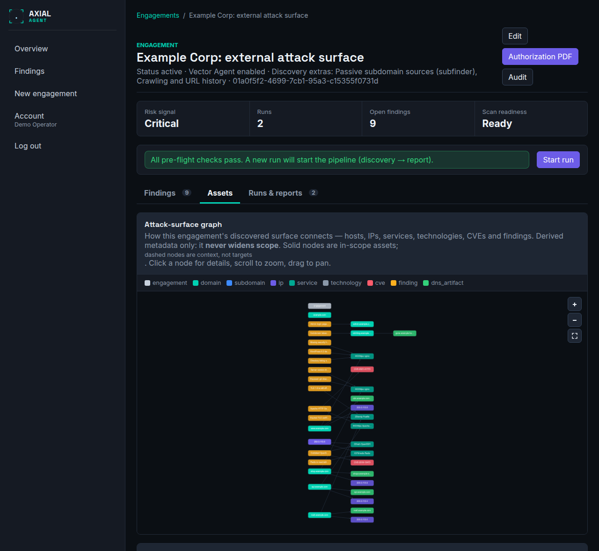
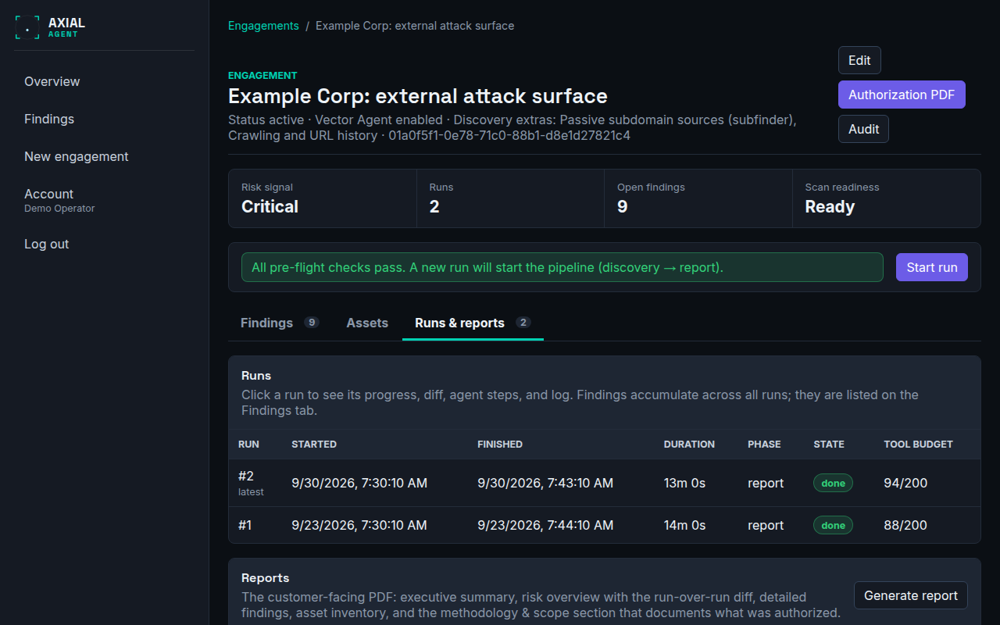
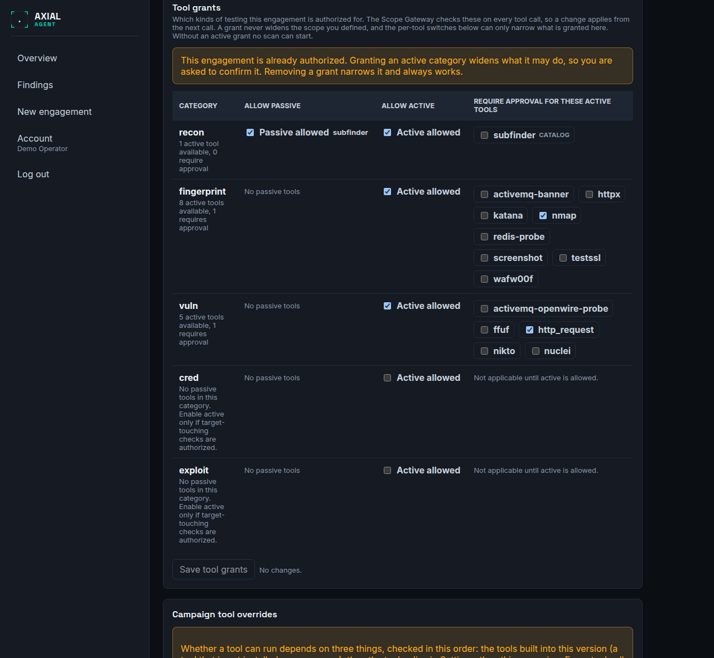

# Engagement: detail and edit

**Who this is for:** operators working on one engagement.
**After this page you can:** find every part of the engagement detail page and the Edit page, say what each field does, and know what can still be changed after activation.

<!-- ui-labels: Risk signal | Runs | Open findings | Scan readiness | Authorization PDF | Authorization not attested | Activate engagement | Start run | Findings | Assets | Runs & reports | Attack-surface graph | DNS & hosting | Crawled endpoints | Web screenshots | Reports | Generate report | Download PDF | Edit engagement | Metadata | Discovery extras | Scan depth | Scan envelope | Tool grants | Campaign tool overrides | Scope assets | Bug bounty program policy | Vector Agent instructions (campaign override) | Vector Agent iteration budget (campaign override) | Manual approval timeout (campaign override) | Save campaign config | Go to tool grants | Open tool grants -->

## Engagement detail (`/engagements/:id`)

The hub of one engagement. At the top: the title, links to **Edit**, **Audit** and the **Authorization PDF**, and a status band. Below it the readiness panel with the **Start run** button, then three tabs.

### The status band

| Item | Meaning |
|---|---|
| **Risk signal** | the highest severity among the engagement's open findings (Critical, High, Medium, Low, Info), or *None open*. Findings you marked accepted risk, false positive or resolved do not count |
| **Runs** | how many runs there have been |
| **Open findings** | how many findings are open |
| **Scan readiness** | *Ready* or *Blocked*: whether a scan can start now |

### Authorization not attested

If an active scope row is not yet attested, the page lists it as **Authorization not attested** and offers *Attest authorization for* each target. Active checks stay blocked until an operator confirms authorization for each target. The **Authorization PDF** remains available for review and signature at any time.

### Activating a draft

A draft engagement shows its tool grants and **Activate engagement** on this page, for example when the wizard was not finished. Activation checks the same requirements as the wizard's last step: allow-scope assets, authorization attestation, the time window and, for bug-bounty engagements, a linked program policy. A failed check says exactly which one is unmet.

### Scan readiness and Start run

Before a run can start, the page checks the pre-flight requirements. If any is unmet, the panel says *This engagement cannot scan yet* and lists each reason as a sentence, with a link to where it is fixed where there is one (**Go to tool grants** on a draft, **Open tool grants** otherwise). **Start run** is disabled until all pass, so no doomed run is started. It is also disabled while a run is active; then a link opens the running run. Every message is explained in [Troubleshooting](../troubleshooting.md#scan-readiness-messages).

### Tabs

The selected tab is part of the page address, so a link, a reload or the browser's Back button keeps it.

**Findings** (opens first). Engagement-wide findings, accumulated and de-duplicated across all runs, with one sub-tab per status and its count: **Open**, **Accepted risk**, **False positive**, **Resolved**. Above the table is a severity filter: *All severities*, Critical, High, Medium, Low, Info; on **Open** each shows how many open findings it has, and clicking the active one again clears it. Columns: Severity, Finding, Found on, Category, Confidence, Score, First seen, Last seen. Click a row to expand the evidence, request a Lens Agent explanation and triage it; the open finding is part of the page address. See [Triage findings](../guides/triage-findings.md).

**Assets** (loads when you open the tab).

- **Attack-surface graph.** How everything discovered for this engagement connects: hosts, IPs, services, technologies, CVEs and findings. A subdomain hangs off its domain, names that resolve to a shared IP join up, a technology fans out across the services that run it, and a technology links to a CVE. It is derived from scan results and **never widens scope**: solid nodes are in-scope assets you can target; dashed nodes (shared IPs, external CNAME targets, technologies, CVEs) are context only and are never scanned. Click a node for its details, scroll to zoom, drag to pan. The same relationships are given to the Vector Agent so it can reason across hosts, for example confirm a weakness in shared infrastructure once instead of re-testing each name.
- **DNS & hosting.** How each in-scope name resolves: the full CNAME chain and the hosting provider (AWS, Azure, Cloudflare, Okta, GitHub Pages and others). This is inventory only: a CNAME target is never scanned and never becomes an asset; only the original name is. A row flagged *dangling* means the CNAME points to a de-provisioned target that an attacker may be able to claim (a subdomain takeover). It is detected at the DNS level only, with no request to the third-party target, and is also raised as a finding for you to verify.
- **Crawled endpoints** and **Web screenshots** appear below, only when crawling or screenshots are on or already have results. Crawled endpoints lists URLs found by crawling and web archives that are inside your scope, with their query parameters and source. Web screenshots shows one thumbnail per page; click one to open it full size.

**Runs & reports.**

- The runs table, newest first: run number, **Started**, **Finished**, **Duration**, **Phase**, **State** and **Tool budget** (tool calls used of the allowed number, 200 by default). *Stopping…* appears while a stop is being applied. Click a row to open [Run detail](run-detail.md). A run whose worker crashed or hung stops sending a heartbeat and is aborted automatically (reason `reaped_stale_heartbeat`), so it can never block a new scan permanently. The reason a run stopped is shown with it; see [Troubleshooting](../troubleshooting.md#why-a-run-stopped).
- **Reports.** **Generate report** creates the customer-facing PDF; the list shows when it was generated, which run it covers, its status and size, and **Download PDF**. See [Reports](../guides/reports.md).

## Edit engagement (`/engagements/:id/edit`)

All settings of an engagement. Everything below can be changed at any status unless it says otherwise.

### Metadata

**Title**, **Emergency contact** (who to call if a test causes problems), **Authorized from** and **Authorized until**, and two switches: **Allow Vector Agent autonomous proposals for this engagement** and **Pause after discovery for manual asset review before scanning continues**. **Status** is shown, not edited. With the pause switch on, each run stops right after discovery and shows every in-scope discovered host for confirmation (see [Run detail](run-detail.md#asset-review)). That is useful when a customer's DNS is poorly managed and discovery may include hosts that are not actually authorised.

### Discovery extras

Four switches: passive subdomain sources (on by default), crawling and URL history, out-of-band testing, and web screenshots (all off by default). A switch only ever narrows what your scope and tool grants already allow, is checked on every tool call by the Scope Gateway, and can be changed at any time; the change applies from the next call. The engagement header lists the ones that are on. What each does: [Tools](../tools.md#optional-discovery-extras).

### Scan depth

**Standard** (default) picks each web service's checks from what the scan found: the generic templates plus only those for the technologies it identified. **Thorough** runs every template on every web service whatever was identified, and adds a deep content-discovery sweep of about 30,000 likely paths per web service (about 25 minutes each; if a slow target or a bug-bounty rate limit cuts it short, it is shown as partial). It is much slower: use it when a complete sweep matters more than time. It applies from the next scan, and each run records the depth it started with. It never widens scope, tool grants or the discovery switches. See [Tune a scan](../guides/tune-a-scan.md).

### Scan envelope

**TCP port from** and **TCP port to**, and **UDP discovery** (a fixed profile of nine common UDP ports). These define the outer limit of what any target may be scanned for, and the raw network scan runs against a signed lease built from them. **They can only be changed while the engagement is a draft.** A scope row can narrow this range for one target, never widen it.

### Tool grants and Campaign tool overrides

The two tool settings, side by side. **Tool grants** says which categories of testing this engagement is authorised for; **Campaign tool overrides** switches single tools on or off for this campaign. They are explained, with the order of the checks, in [Control which tools run](../guides/control-which-tools-run.md). Tool grants can be changed until the engagement ends; adding an active category to an engagement that is already authorised asks for confirmation, and nothing can be added while a scan runs.

The overrides table has these columns: **Tool**, **Category**, **Available** (can it run here, and if not why), **This campaign** (*Inherit global*, *Force on*, *Force off*) and **Approval**. **Save campaign config** saves the overrides together with the three campaign settings below.

### Campaign settings for the agent

**Vector Agent instructions (campaign override)** shows the effective instructions text, the global one unless this campaign overrides it, and can save a campaign-specific override without affecting other campaigns. **Vector Agent iteration budget (campaign override)** and **Manual approval timeout (campaign override)** do the same for the maximum number of agent round-trips and for how long a state-changing request waits for your decision. Leave a field empty to inherit the global value from [Settings](settings.md).

### Bug bounty program policy

Only for an engagement that follows a real bug-bounty or disclosure program. It records the platform and program, whether the program permits automated testing, the request-rate and concurrency caps, the identification header or User-Agent suffix to send, and the network-scan tier. See [Define an engagement and its scope](../guides/define-an-engagement.md#bug-bounty-engagements).

### Scope assets

The allow and deny rules of the engagement, viewable and editable after creation, not only in the wizard. The table shows **Rule**, **Type**, **Value**, **Ports** and **Active-allowed**, with **Remove** for each row, and a form to add more. Deny always wins over allow. A host you excluded in an asset review appears here as an automatically added deny row; remove it to include the host again in future scans.
