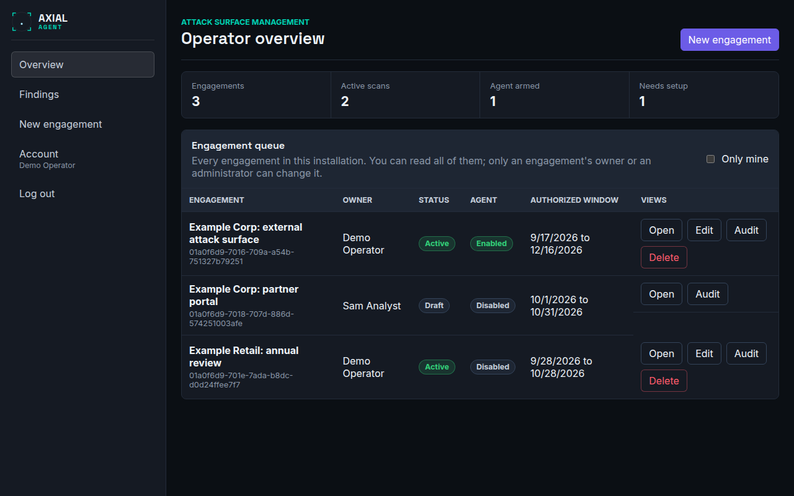
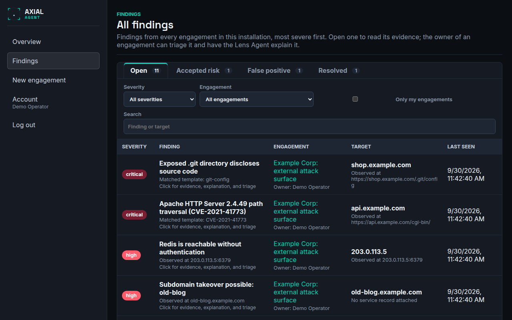

# Overview and All findings

**Who this is for:** operators and admins starting their day in the console.
**After this page you can:** read the overview of your engagements, understand each column and status, and use the cross-engagement findings list to see what needs attention first.

<!-- ui-labels: Operator overview | Engagement queue | Engagements | Active scans | Agent armed | Needs setup | Authorized window | Owner | Only mine | All findings | All severities | All engagements | Only my engagements | Previous | Next | Open in engagement → | Create an engagement | Start with your first engagement -->

## Overview (`/`)

The landing page lists every engagement in the installation, with its owner and its status. Click an engagement to open its detail page. You can read all of them; you can change only the ones you own (an administrator can change all). Tick **Only mine** to list, and count, just your own.

An empty installation shows **Start with your first engagement**, a short reminder that an engagement is one authorised assessment (what you may test, when, and with which tools), and a button, **Create an engagement**.

### The metric strip

| Metric | Counts |
|---|---|
| **Engagements** | the engagements in the list (all, or just yours with **Only mine**) |
| **Active scans** | engagements with a run in progress |
| **Agent armed** | engagements where the Vector Agent is switched on |
| **Needs setup** | engagements still in `draft` or `awaiting_signature` |

### The engagement queue

| Column | Meaning |
|---|---|
| **Engagement** | the title. Click it to open the engagement |
| **Owner** | who owns it (hover for their email). Ask them when you want something changed |
| Status | `draft` until you activate it, then `active`. Only an active engagement can scan. See [Concepts](../concepts.md#engagement) |
| Agent | whether autonomous Vector Agent proposals are enabled (opt-in) |
| **Authorized window** | the dates in which scanning is permitted. Outside it every tool call is denied, so a scan is blocked before it starts |
| Views | **Open** the engagement and open its **Audit** trail. **Edit** its settings and **Delete** it appear only on an engagement you may change |

Deleting an engagement removes its findings and scope. The audit trail is retained.

## All findings (`/findings`)

Every finding from every engagement in the installation, in one list, most severe first and then by risk score. It is the place to start the day. Open it with **Findings** in the navigation.

| Part | What it does |
|---|---|
| Status tabs | **Open**, **Accepted risk**, **False positive** and **Resolved**, each with its count; the same statuses as on an engagement's Findings tab |
| **Severity** | filters to one severity; **All severities** clears it |
| **Engagement** | filters to one engagement; **All engagements** clears it |
| **Only my engagements** | keeps only the findings of engagements you own |
| **Search** | matches the finding's title or the target's name |
| Columns | **Severity**, **Finding**, **Engagement** (with its owner), **Target** and **Last seen** |
| **Previous** and **Next** | 50 findings per page |

Click a row to open the same detail as on the engagement page: the Lens Agent explanation, triage (resolve, accept risk, false positive), the facts and the evidence. On someone else's engagement you can read all of it; triage and the Lens request are for its owner and administrators. **Open in engagement →** jumps to the finding inside its engagement. See [Triage findings](../guides/triage-findings.md).

The filters are part of the page address, so you can bookmark a view or send it to a colleague. Everyone who is signed in sees the same findings for the same filters; **Only my engagements** is the only thing that narrows by owner.
