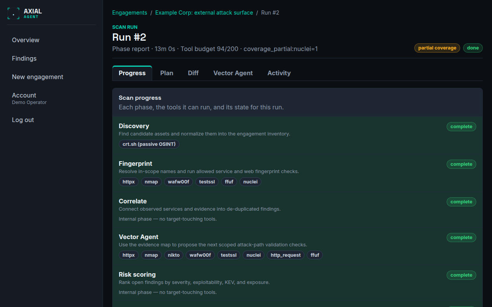
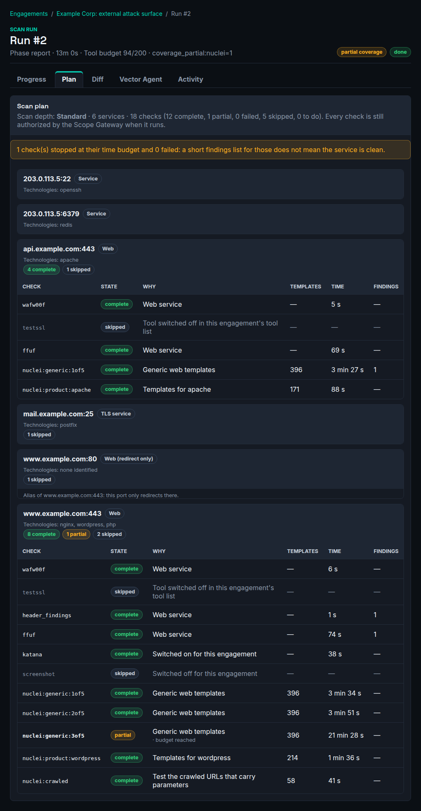
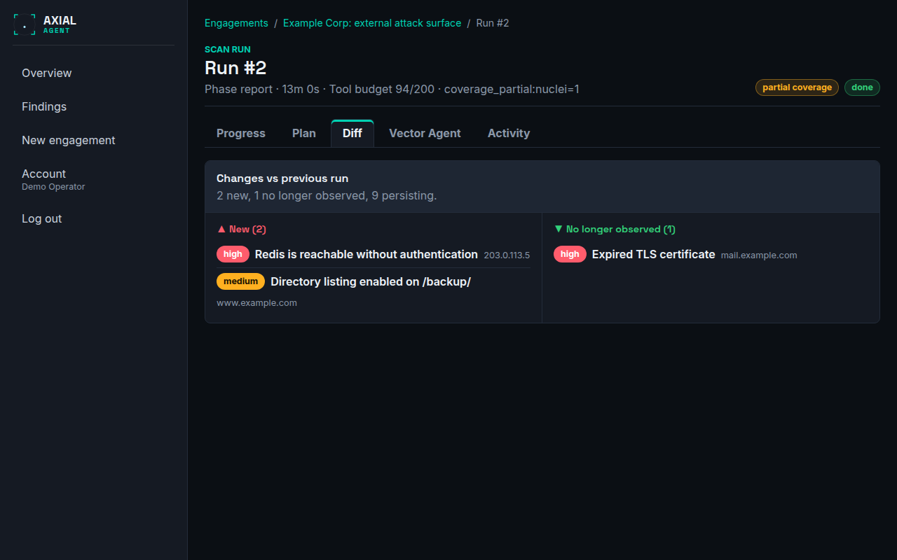
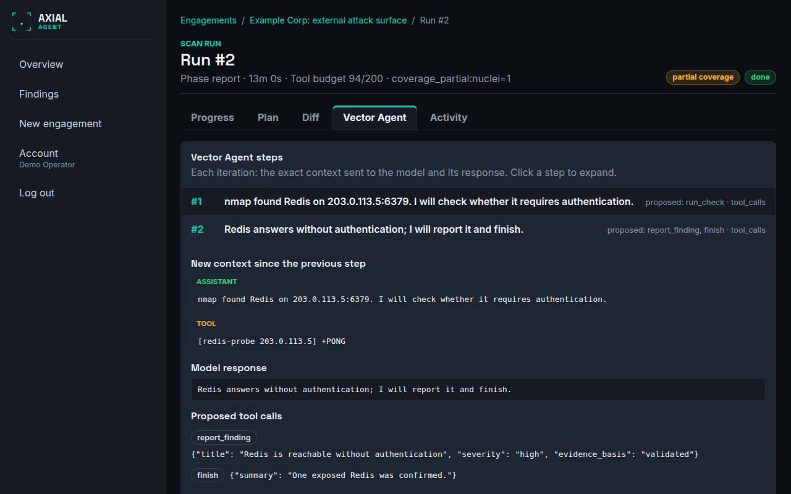
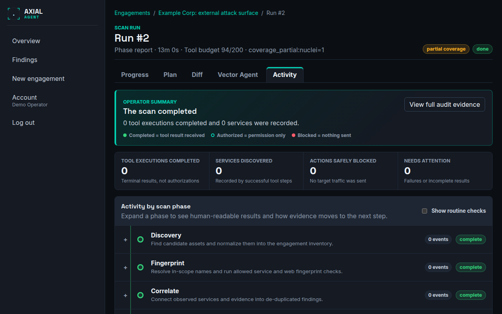
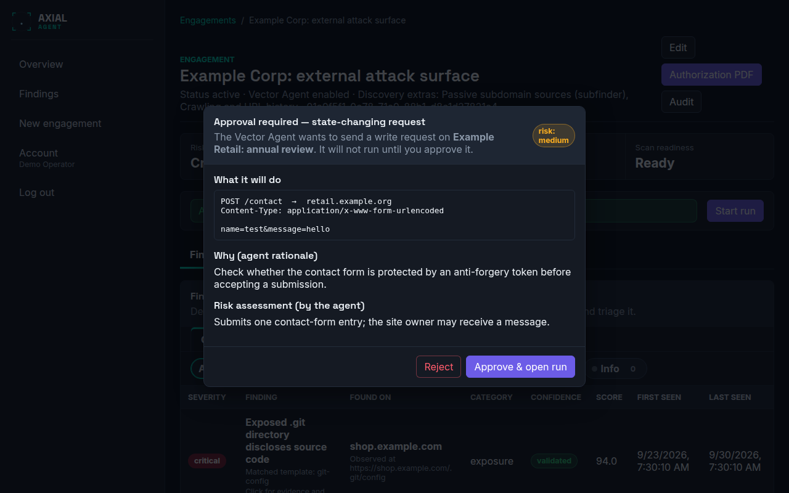

# Run detail

**Who this is for:** operators watching a scan or working out what a finished one did.
**After this page you can:** read each tab of a run, understand the two popups that can interrupt it, and stop a run safely.

<!-- ui-labels: Scan run | Stop scan | Stop requested | Progress | Plan | Diff | Vector Agent | Activity | Scan progress | Scan plan | Changes vs previous run | Vector Agent steps | Operator summary | Activity by scan phase | Show routine checks | Approval required — state-changing request | What it will do | Why (agent rationale) | Risk assessment (by the agent) | Reject | Approve & open run | Review discovered assets | Continue with selected | reduced coverage | partial coverage -->

## The page (`/engagements/:id/runs/:runId`)

Everything about **one** run. A breadcrumb shows *Engagements / {engagement} / Run #{n}*, and the heading gives the phase the run is in, how long it has taken, the **tool budget** used out of the allowed number of tool calls, and, if it stopped for a reason, that reason. Next to it:

- A **state** pill: `running`, `waiting_approval`, `done`, `failed` or `aborted`. *stopping…* appears while a stop is being applied.
- **reduced coverage**: a tool the scan depends on was attempted but never once succeeded, so the result is *not* a clean bill of health. Hover for the detail.
- **partial coverage**: at least one check stopped at its time budget before it finished. What it reported is real, but a short list does not mean the surface is clean.
- **Stop scan**, while the run is active. It becomes **Stop requested** once pressed.

While a tool is running, a banner says which tool on which target and for how long.

## Progress

**Scan progress** lists the pipeline phases, the tools each one can run and its state for this run. The internal phases (correlate, scoring, report) touch no targets and say so.

## Plan

**Scan plan** shows what this run planned and what became of it. There is one block per open port: its class (web, redirect only, TLS service, other service), the technologies identified and, for each check, the reason it runs or is skipped, its state (*complete*, *partial*, *failed*, *skipped*, *running*), the number of templates, the time and the findings. The plan appears once the scan has found which ports are open and what runs on them, and it updates while the run executes.

- A port that only redirects to another scanned port is listed with its checks skipped and the target named.
- A check that stopped at its time budget is **partial** and a failed one is **failed**: **neither means the service is clean**.
- A run that is resumed after a restart continues with the checks that were not finished; checks that were complete are not run again.
- Every check is still authorised by the Scope Gateway when it runs. The plan itself authorises nothing.

The reasons shown for a skipped or failed check are explained in [Troubleshooting](../troubleshooting.md#why-a-check-was-skipped-or-failed).

## Diff

**Changes vs previous run**: findings newly observed, findings no longer observed, and how many persist. The first run of an engagement has no baseline. See [Compare runs](../guides/compare-runs.md).

## Vector Agent

**Vector Agent steps** lists every agent iteration. Click a step to see the exact input sent to the model (the system prompt and the running messages) and the model's response and proposed tool calls. API keys are never stored. An observation marked *EGRESS BLOCKED* means the request was stopped at the egress proxy and never reached the target: it is an infrastructure block, not a clean result. If the agent did not run, the tab says why: no AI provider configured, the agent switched off, or the run stopped before the agent phase.

## Activity

The **Operator summary** counts what happened in plain terms: tool executions completed (terminal results, not authorisations), services discovered, actions safely blocked (no traffic was sent), and what **needs attention** (failures or incomplete results). **Activity by scan phase** then groups the human-readable results per phase: what each step used, produced and passed on. Routine checks are collapsed; **Show routine checks** expands them. Each entry can be expanded for its technical details, the reason code and the full response with secret values redacted. The complete raw trail is on the [Audit](audit.md) page.

Three words to keep apart: *completed* means a tool result was received; *authorized* means only that permission was granted; *blocked* means nothing was sent.

## Approval popup

A scan runs on its own, but a state-changing request (POST, PUT, DELETE, PATCH, or any request with a body), and any tool you marked for approval, never runs on its own. When the agent proposes one, the run pauses (`waiting_approval`) and a popup titled **Approval required — state-changing request** shows:

| Part | Shows |
|---|---|
| **What it will do** | the exact request |
| **Why (agent rationale)** | the agent's reason |
| **Risk assessment (by the agent)** | the agent's own risk level and description |

The popup appears wherever you are in the console, not only on this screen, and names the engagement it belongs to, so you cannot miss it. **Approve & open run** takes you straight to the run so you can watch the request execute and see its result fed back to the agent. **Reject** skips it. There is one popup per request; others queue. If nobody decides within the approval timeout, the request is rejected automatically. See [Approve or deny a tool call](../guides/approve-or-deny-a-tool-call.md).

## Asset review

Only appears when **Pause after discovery for manual asset review** is switched on for the engagement. Right after discovery the run pauses and a popup titled **Review discovered assets** lists every host the current scope allows for active testing, all pre-selected. Names and addresses that are out of scope, denied or passive-only are already left out. Deselect any host that should not be scanned, for example stale DNS pointing outside your control, then choose **Continue with selected**.

Deselected hosts become a real deny rule, enforced by the Scope Gateway and visible under **Edit engagement → Scope assets**, which excludes them from this and future runs. A review can only narrow what gets scanned, never widen it. If you do not answer within the review window (15 minutes), the run aborts rather than silently scanning everything.

## Stopping a run

**Stop scan** stops a running run cooperatively. The control plane marks the run `aborted` at once and closes pending approvals; the worker terminates only that run's tool processes, and raw network scanning gives up its short-lived network permission. No other run is touched. If the control plane cannot be asked whether you cancelled, the run stops anyway as a safety measure and says `cancellation_status_unavailable`; see [Troubleshooting](../troubleshooting.md#why-a-run-stopped).
