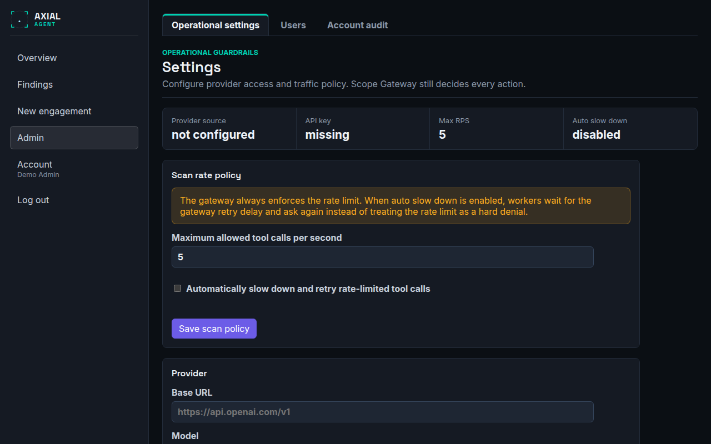

# Settings (Admin)

**Who this is for:** administrators who configure the installation.
**After this page you can:** say what each global setting does, what its default is, and which of them an individual engagement can override.

<!-- ui-labels: Admin | Operational settings | Users | Account audit | Operational guardrails | Provider source | API key | Max RPS | Auto slow down | Scan rate policy | Maximum allowed tool calls per second | Automatically slow down and retry rate-limited tool calls | Provider | Base URL | Model | NVD API key (optional) | Tool policy (global defaults) | Needs approval | Vector Agent iteration budget (global default) | Max iterations | Vector Agent max tokens (global default) | Max tokens | Manual approval timeout (global default) | Timeout (seconds) | Vector Agent instructions (global default) | Subdomain source keys (optional) -->

## The Admin hub (`/admin`)

**Admin** is only in the navigation for administrators; an operator who opens the address sees *You need an administrator role to view this page*. It has three tabs: **Operational settings** (this page), **Users** and **Account audit** (see [Account, sign-in and administration](account-and-admin.md)). The old addresses `/settings`, `/admin/users` and `/admin/audit` open this hub.

## Operational settings

The page is titled *Settings*, with the subtitle *Operational guardrails*: provider access and traffic policy. The Scope Gateway still decides every action regardless of anything here. A strip at the top shows the **Provider source**, whether the **API key** is set, the **Max RPS** and whether **Auto slow down** is on.

### Provider

The AI provider used by the Vector Agent and the Lens Agent: a **Base URL**, a **Model** and an **API key**. The client speaks the Chat Completions format used by OpenAI and many compatible gateways. A base URL ending in `/responses` is normalised before use, but the provider must still offer a compatible `/chat/completions` endpoint. The API key is write-only: the page shows whether one is set, never the key. The **Provider source** tells you whether the values come from the environment or from what an admin saved here; a value saved here overrides the environment. Without a provider the agent phase does nothing and the Lens Agent cannot explain findings. Step by step: [Configure the AI provider](../guides/configure-the-llm.md).

### Scan rate policy

**Maximum allowed tool calls per second** (default 5): the gateway always enforces it. With **Automatically slow down and retry rate-limited tool calls** on, a worker whose call is rate-limited waits for the gateway's retry delay and asks again instead of treating it as a hard denial. A bug-bounty engagement's own request-rate cap is enforced on top of it for that engagement.

### NVD API key (optional)

Used by the live CVE correlation (NVD, EPSS and the CISA known-exploited list) for services the scan fingerprinted. It works without a key at NVD's public rate limit (5 requests per 30 seconds); a free NVD API key raises that to 50. It is never required.

### Tool policy (global defaults)

Per tool: **Enabled**, and whether it **Needs approval** (one-time, per call). A tool that is not installed can never be enabled, and scope and argument safety stay enforced whatever you set. A campaign can override these per engagement under **Campaign tool overrides**. How the layers combine: [Control which tools run](../guides/control-which-tools-run.md).

### Vector Agent iteration budget (global default)

**Max iterations**: the number of tool-call round-trips the agent may make per run before it must conclude. Default 50, between 1 and 500. Higher values let it investigate more but cost more time and tokens. A malformed or rejected proposal still uses one iteration, so raise this if the agent runs out of budget before it finishes. A campaign can override it.

### Vector Agent max tokens (global default)

**Max tokens**: the cap on the model's output in one turn, its reasoning plus the tool-call JSON itself, *not* the context window. Default 8,192, between 1,024 and 32,768. Set too low, a turn is cut off in the middle of the JSON, the tool call fails to parse and the agent stalls without an obvious reason. A campaign can override it.

### Manual approval timeout (global default)

**Timeout (seconds)**: how long a state-changing request waits for an operator's decision before it is rejected automatically, so a scan cannot hang if nobody is at the desk. Default 900 seconds (15 minutes), between 60 seconds and 24 hours. A campaign can override it.

### Vector Agent instructions (global default)

The agent's system prompt, always shown. It starts as the built-in default (a platform overview, awareness of the engagement's parameters and a check list based on the OWASP Top 10) and is editable in place. **Editing it is safe:** the Scope Gateway decides every action regardless of the prompt, so no prompt can cause an out-of-scope or destructive action. Save an empty box to return to the built-in default. Each engagement's Edit page shows the same effective text and can save its own override.

### Subdomain source keys (optional)

Optional API keys for subfinder's data sources. subfinder works without keys; some sources return more with a free key. Keys are stored encrypted, are write-only (the page shows whether one is set, never the key), and are used only for these lookups. Leave a field empty to keep the current key; **Remove** deletes it.
