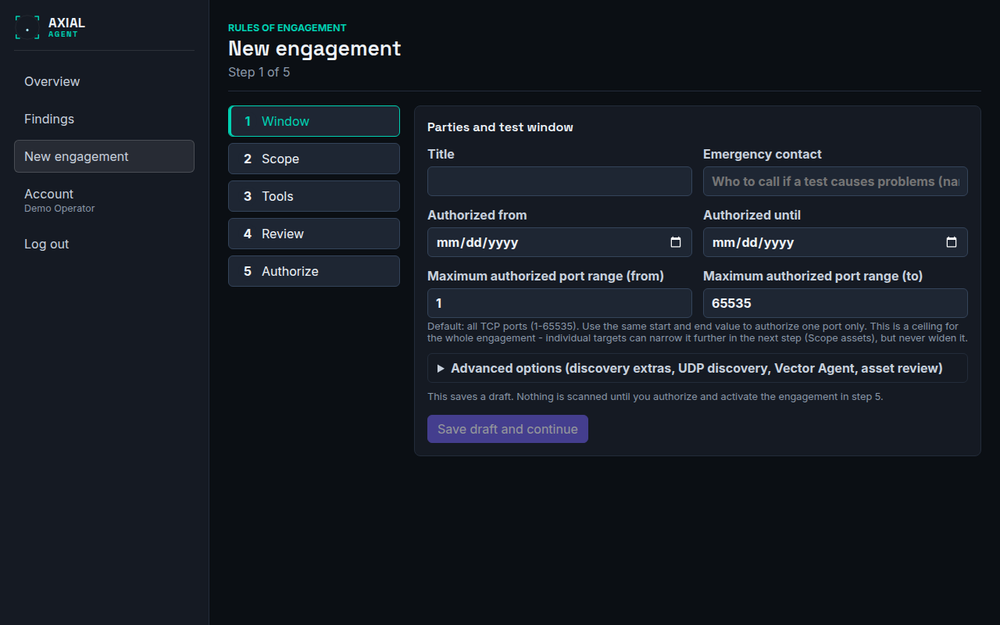

# New engagement wizard

**Who this is for:** operators creating an engagement.
**After this page you can:** say what every step and field of the wizard does, go back and change an earlier step without creating a second engagement, and pick up an unfinished draft.

<!-- ui-labels: New engagement | Parties and test window | Title | Emergency contact | Authorized from | Authorized until | Maximum authorized port range (from) | Maximum authorized port range (to) | Advanced options (discovery extras, UDP discovery, Vector Agent, asset review) | Save draft and continue | Save changes and continue | Scope assets | Add scope row | Continue | active | authorization attested | Tool grants | Allow passive | Allow active | Require approval for these active tools | Back | Save scope and tools | Agent and guardrail review | Review authorization | Authorization checklist | Download authorization PDF | Activate engagement | This engagement follows a bug bounty program's rules of engagement -->

## The five steps (`/new`)

The sidebar of the wizard shows the steps: **Window**, **Scope**, **Tools**, **Review**, **Authorize**. You can click back to any earlier step. Nothing is scanned until you authorise and activate the engagement in the last step.

### One draft, however often you save

The first save creates one **draft** engagement. If you go back to an earlier step and save again, the button reads **Save changes and continue** and updates that same draft; it never creates a second one. Saving the Scope step again only sends rows that are new or changed. The draft's id is kept in the page address as `/new?draft=<id>`, so reloading the page, or opening that address again, resumes the draft at the Scope step with your fields and scope rows restored. Only a draft you can open can be resumed; for anything else the wizard says so and creates nothing.

### 1. Window: **Parties and test window**

| Field | Meaning |
|---|---|
| **Title** | a name you will recognise |
| **Emergency contact** | who to call if a test causes problems (name and phone) |
| **Authorized from** and **Authorized until** | the dates in which scanning is permitted. Outside them every tool call is denied |
| **Maximum authorized port range (from)** and **(to)** | the outer limit of TCP ports for the whole engagement. The default is all TCP ports, 1 to 65535. Use the same value twice to authorise one port only. Individual targets can narrow this range in the next step, never widen it |

These values define the network envelope of the scan: the raw network scan runs against a signed lease built from them. They can only be changed while the engagement is a draft.

**Advanced options** (folded away; everything defaults to off except passive subdomain sources):

- **Discovery extras**: passive subdomain sources, crawling and URL history, out-of-band testing, web screenshots. See [Tune a scan](../guides/tune-a-scan.md).
- **Scan depth**: Standard or Thorough.
- **Enable bounded UDP discovery**: a fixed list of nine common UDP ports (53, 123, 161, 443, 500, 1900, 4500, 5060, 5353), nothing else.
- **Allow Vector Agent autonomous proposals for this engagement**: switches the AI agent on.
- **Pause after discovery for manual asset review before scanning continues**: see [Run detail](run-detail.md#asset-review).

Choose **Save draft and continue**.

### 2. Scope: **Scope assets**

Add the rows that define what may be tested. Enter at least one allow row. Each row has a **rule** (`allow` or `deny`), a **type** (`domain`, `wildcard`, `ip`, `cidr` or `cloud_account`), a **value**, an optional port range, and two ticks:

- **active**: the scan may send requests to this target. Without it the target can only be looked at passively.
- **authorization attested**: you confirm that you are permitted to test it. Active checks require the attestation for every active allow row.

A domain row includes its discovered subdomains automatically. The port fields are optional; leave them blank to inherit the engagement's range. For an IP range the wizard warns that host discovery only probes TCP 80 and 443 (a deliberate, bounded policy), so a host that answers on neither is not found by the sweep. **Add scope row** adds another row; **Continue** moves on. Details and examples: [Define an engagement and its scope](../guides/define-an-engagement.md).

### 3. Tools: **Tool grants**

A table of the tool categories (recon, fingerprint, vuln, cred, exploit). For each:

- **Allow passive**: public-source enrichment such as certificate logs and passive subdomain sources. It does not run target-touching checks. Only offered for categories that really have a passive tool.
- **Allow active**: target-touching tools, after scope, time window, allow-list and argument checks pass.
- **Require approval for these active tools**: the tools you pick stop at the gateway until an operator approves that exact call. This is not a separate permission to run a category: a tool can only ask for approval once its category is active, the target is in scope and the gateway would otherwise allow it. For the `vuln`, `cred` and `exploit` categories every tool is pre-selected.

Below the table, **This engagement follows a bug bounty program's rules of engagement** is for a real bug-bounty or disclosure program that requires self-identification and a request-rate cap; it opens the program fields. See [Define an engagement and its scope](../guides/define-an-engagement.md#bug-bounty-engagements). Choose **Save scope and tools**. [Control which tools run](../guides/control-which-tools-run.md) explains the three controls in detail.

### 4. Review: **Agent and guardrail review**

A read-only summary: that the Scope Gateway authorises every active tool call, whether the Vector Agent is on, the TCP and UDP discovery settings, the asset review pause, the discovery extras, the scan depth, the default posture (non-destructive, scoped, budgeted checks) and how many manual approvals are set. Choose **Review authorization**.

### 5. Authorize: **Authorization checklist**

The checklist shows the engagement, the agent setting, the discovery settings, the scan depth, how many allow rows there are and how many of them are active, and how many tools need manual approval. **Activation is blocked** until at least one allow row has a value and has been saved, and until authorization is attested for every active allow row; the page says which. **Download authorization PDF** produces a document stating exactly what is configured, for signature before activation. **Activate engagement** makes the engagement `active` and opens it. See [Authorize and activate](../guides/authorize-and-activate.md).
