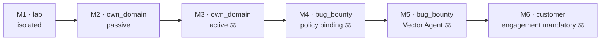

# Maturity Path & Roadmap

Source: [Technical Architecture Ch. 7](spec/technical-architecture.md#7-implementation-order-mvp--expansion), [Lab Environment Ch. 4.2](spec/lab-environment.md#42-placement-in-the-maturity-path).

The maturity path runs parallel to the `source` model: build in the lab
first, then verify on your own domain, then harden on authorized bug-bounty
scopes — and only after that, on a paying customer. The security layer is
in place at every stage **before** that stage's new active capability.

## Status per stage in this repository

| Stage | Scope | Status |
|---|---|---|
| **M1** | `engagement`/scope model, gateway, audit log, passive discovery+fingerprint | ✅ data model, `authorize()`, audit hash chain, wizard, live log, crt.sh/lab discovery, **lab test loop with a real scan** |
| **M2** | CVE correlation, scoring, PDF report, dashboard | 🟡 risk score/severity ✅ (incl. a persistent KEV override); local CVE mapping for the lab ✅; **live NVD/EPSS/CISA-KEV correlation for real targets ✅** ([REQ-CORR-001..008](requirements/live-vulnerability-correlation.md), johannes's review pending); PDF rendering open |
| **M3** | active fingerprinting, safe active checks, approval workflow, rate limiting | 🟡 approval workflow + rate limiting ✅; **minimal tool-runner dispatch (nmap + header check) verified end-to-end** ([lab_runner.py](../tool-runner/lab_runner.py)); full HexStrike/Kali integration open |
| **M4** | `bounty_program` model, ident header, deny precedence & policy gates | 🟡 data model + gateway checks ✅; K8s job dispatch open |
| **M5** | Vector Agent with gateway coupling | 🟡 the reason-act-observe loop **against an OpenAI-compatible interface** (base_url/api_key/model, via GUI/env; e.g. OpenAI/Eden AI) ✅; every proposal through the gateway, triple-bounded (ai_testing_allowed opt-in + budget ceiling + deterministic scope check) ✅; agent-heuristic tuning open |
| **M6** | scheduler, diff trend, multi-customer, suppression lists | ⬜ open |

## Live-test milestone: M1 complete

A complete end-to-end run against real Metasploitable2/Juice Shop/DVWA was
reproducibly green: isolation → Scope Gateway (positive **and** negative)
→ a real nmap scan → 12 correct findings (incl. `critical` for
vsftpd/CVE-2011-2523 via the CISA-KEV override) → the negative test at the
finding level (0 hits for `clean-nginx`). False-negative rate against the
test oracle: 25% (threshold 30%). Proven with the minimal
[`tool-runner/lab_runner.py`](../tool-runner/lab_runner.py) — details:
[testing.md](testing.md#live-scan-against-the-lab).

## HexStrike integration status

`tool-runner/runner.Dockerfile` builds the **real** HexStrike (no longer
`lab_runner.py`) and is currently live. Three surgical fixes to the
upstream repo were needed (MIT-licensed, all three via `sed` at build time,
no fork needed):

1. **`pwntools`/`angr` removed from `requirements.txt`.** Source-code
   review (not just doc comments) confirms: the main server never imports
   either at module level — only two string references in a tool-check
   table and two f-string templates for separate child processes (binary-
   exploitation endpoints we don't whitelist anyway). The build guard was
   strengthened accordingly (an import check directly inside HexStrike's
   own venv, not just `command -v` on system binaries — otherwise this
   exact case would be invisible).
2. **The log path redirected to `/tmp`.** `hexstrike_server.py` writes
   hard to `./hexstrike.log` (cwd-relative); collides with
   `readOnlyRootFilesystem`. HexStrike's own fallback catches only
   `PermissionError`, not the `OSError(EROFS)` that actually occurs —
   without the patch, the server crashes on startup under `read_only:
   true`.
3. **`--host`/env-var assumptions corrected.** `--host` isn't a real CLI
   argument (would have aborted startup with "unrecognized arguments");
   `HEXSTRIKE_VALIDATE_COMMANDS`/`HEXSTRIKE_REQUIRE_API_KEY` don't exist in
   the real code (no-ops).

**Verified working:** server startup, `GET /health`, and the endpoints for
`nikto`, `wafw00f`, `subfinder`, `amass` (sandbox-free, pure userspace
processes). **Not proven end-to-end with real findings:** `nmap` — Kali's
nmap package ships a wrapper that re-execs itself with `--privileged` when
run non-root; that exec fails in the development sandbox this repo was
built in, with `EPERM` (diagnosis: not Linux capabilities — also fails as
root with full Docker default caps; not Docker seccomp/AppArmor — also
fails with `--security-opt unconfined` for both). This points to a
restriction of the agent sandbox itself, not a bug in `runner.Dockerfile`
or the capability configuration (`cap_add: [NET_RAW, NET_ADMIN]`). This
should not occur on normal server/Kubernetes infrastructure — verify
before production use on real target infrastructure.

`worker/app/tool_runner_client.py` talks to the real HexStrike endpoints
(`/api/tools/nmap|nuclei|nikto|subfinder|amass|wafw00f|httpx`,
reverse-engineered from the source — HexStrike doesn't document its REST
contracts separately). `lab_runner.py` stays in the repo as a
proven-working fallback, in case the HexStrike build/clone is ever
unavailable, or the nmap issue recurs on a specific target infrastructure.

## Real live test: recon works, the egress-proxy path has a gap

A test against a real external domain (`own_domain`, not lab) found:

**Recon works completely and for real.** `discovery.py` found real
subdomains of a production domain via crt.sh (6 hits, 5 previously
unknown). A real bug was found and fixed in the process: the crt.sh
timeout was too tight at 20s (the service often responds slower) →
raised to 60s. The gateway rate limit correctly kicked in (the 6th target
within 1s → `rate_limited`).

**Scanning/enumeration against real external targets does NOT yet work in
the current M1–M3 Docker Compose setup** — independent of the nmap sandbox
issue above. Root cause: `HTTPS_PROXY`/`HTTP_PROXY` as env vars on the
tool-runner do **nothing** for the CLI tools actually used (nmap, nikto,
…) — none of them are proxy-aware via standard env vars (nikto, for
example, would need `-useproxy <url>` explicitly, which HexStrike never
sets). The `runner` network deliberately has no internet route of its own
— only the egress proxy has one. Without a tool actively talking to the
proxy, even DNS resolution fails ("Temporary failure in name resolution")
before any request even goes out. Tested and confirmed with `nikto`
against a real domain over the correctly wired production path (`docker
compose --profile runner up`, `tool-runner` additionally attached to the
`ctrl` network - previously unreachable from the worker at all, also a
finding of this test).

Why the lab tests worked anyway: `tool-runner-lab` sits on the **same**
Docker network as the lab targets (`lab`) - no proxy hop, no DNS problem.
For real external targets, that shortcut is rightly absent (isolation is
the whole point). The chosen M3/M4 path is now split in two: HTTP-aware
tools keep using the egress proxy; nmap/raw scans get a per-engagement
generated Kubernetes NetworkPolicy from active IP/CIDR scope assets (`GET
/internal/engagements/{id}/raw-egress-policy`, see
`control-plane/app/gateway/raw_egress_policy.py` and
`deployment/k8s/networkpolicy-runner-raw-egress.yaml`). Domain/wildcard
scope stays fail-closed for raw egress until an audited DNS materialization
produces IPs for the scan run.

## DNS materialization + nmap: done and live-verified

The previously open priority-0 item (domain/wildcard scope → IP allowlist
for raw egress) is built, tested, and verified against a real domain:

- **`control-plane/app/gateway/dns_materialization.py`** resolves active
  domain-allow assets + in-scope discovered assets to IPs, applies deny
  precedence at the IP level, and records the result audited (the
  `resolved_host` table + a `dns_materialization` `audit_log` entry). Only
  the control plane (the trust anchor) executes this - resolution, the
  deny check, and persistence are atomic.
- **Endpoint** `POST /internal/engagements/{id}/materialize-dns`.
- The **raw-egress-policy renderer** feeds the materialized IPs into the
  NetworkPolicy as `/32`/`/128` blocks; unresolved names stay fail-closed.
- **Live test** against a real owned domain: 6 subdomains → 2 IPs
  materialized (audited), the policy rendered both as `/32` blocks; nmap
  ran successfully from the real runner image against the materialized IP
  (Postfix/nginx/IMAPS detected). The nmap wrapper fix (above) resolved
  the earlier EPERM problem — nmap now runs for real.

## Concrete next steps

0. **A job launcher that applies the policy** — the endpoint *renders* the
   NetworkPolicy, but doesn't yet *apply* it. A launcher needs to: create
   the policy → start the nmap job → delete the policy on TTL/job end.
1. **Verify nmap execution on real K8s target infrastructure** — in this
   Compose environment, the `NET_RAW` wrapper fix is already proven (nmap
   scans real targets). On K8s, additionally verify the generated
   NetworkPolicy as a real egress boundary (Compose doesn't enforce
   NetworkPolicies).
2. **Finish the nuclei integration** — the endpoint is mapped in
   `tool_runner_client.py`, but not yet dispatched in `fingerprint.py`;
   nuclei templates need internet access on first run
   (`-update-templates`), which isn't available on the isolated lab
   network.
3. **MCP `--profile` integration**: HexStrike's `--profile` mechanism
   (Technical Architecture Ch. 4.3) isn't coupled to `tool_grant` yet —
   the worker currently calls individual endpoints directly and
   explicitly.
4. ~~**NVD/EPSS API correlation** for real (non-lab) targets~~ done:
   [REQ-CORR-001..008](requirements/live-vulnerability-correlation.md),
   [architecture](design/live-vulnerability-correlation-architecture.md),
   [`worker/app/tasks/correlate.py`](../worker/app/tasks/correlate.py) —
   cache tables (migration `0018`), six internal endpoints, an optional
   NVD API key (settings), local mapping
   ([`worker/app/known_vulns.py`](../worker/app/known_vulns.py)) stays the
   fallback for lab tests. R3, johannes's security review still pending
   (status remains `draft`).
5. **PDF report rendering** ([`control-plane/app/api/findings.py`](../control-plane/app/api/findings.py)).
6. **Vector Agent LLM integration** ([`worker/app/tasks/agent.py`](../worker/app/tasks/agent.py))
   — deliberately only after M4, once the bug-bounty guardrails are
   demonstrably working.
7. **Vault/SOPS** instead of `.env` placeholders.
8. **Customer view** (read-only derivation, UI Ch. 7) with RBAC.
9. **Nmap scheduling and scan envelopes (implemented, release review open)** — FIFO for the shared Compose gateway, a persisted TCP single port/range, and an opt-in UDP nine-port profile. See [REQ-SCAN-011](requirements/backlog-udp-discovery.md), [REQ-SCAN-012](requirements/backlog-nmap-gateway-queue.md), and [REQ-SCAN-013](requirements/backlog-engagement-port-range.md).

## Why the lab comes first

In the lab you can fail destructively without risk: no real target, no
legal questions, no reputational damage. Only once both the positive
**and** negative test are reproducibly green does it move to your own
domains — and only after that, outward. See [testing.md](testing.md).

## Minimum safe-operation baseline

The single-operator safety baseline now includes production configuration validation, operator authentication, control-plane-owned serialized proxy auditing, and atomic approval claim/reauthorization. This does not make the product multi-tenant or enterprise-ready; RBAC/workload identity and signed runner-bound dispatch artifacts remain later maturity gates.

## Scan-integrity baseline

The worker now retries output-limit-truncated model responses within bounded budgets, records incomplete agent outcomes, carries fingerprint services into correlation, and persists terminal tool-execution evidence. Compose now has a signed, heartbeat-scoped, single-active-lease nftables gateway with bounded FIFO scheduling. Nmap scans the persisted TCP envelope and optionally the fixed nine-port UDP profile against only the audited materialized IP; service detection receives only confirmed-open ports and UDP ambiguity stays visible. The remaining production maturity step is the Kubernetes Job launcher that applies and removes the already generated per-engagement NetworkPolicy.
