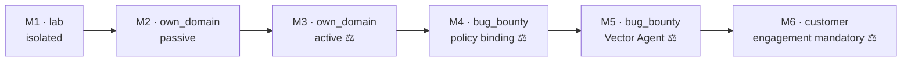

# Maturity Path & Roadmap

Source: [Technical Architecture Ch. 7](spec/technical-architecture.md#7-implementation-order-mvp--expansion), [Lab Environment Ch. 4.2](spec/lab-environment.md#42-placement-in-the-maturity-path).

The maturity path runs parallel to the `source` model: build in the lab
first, then verify on your own domain, then harden on authorized bug-bounty
scopes — and only after that, on a paying customer. The security layer is
in place at every stage **before** that stage's new active capability.

## Where the project stands

| Stage | Scope | Status |
|---|---|---|
| **M1** | engagement/scope model, Scope Gateway, audit log, passive discovery | ✅ Deterministic gateway with deny precedence, hash-chained audit log, engagement wizard, live run view, multi-source passive discovery, and an isolated lab test loop. |
| **M2** | vulnerability correlation, scoring, report, dashboard | ✅ Live NVD/EPSS/CISA-KEV correlation, risk scoring with a persistent KEV override, run-over-run diff, attack-surface graph, and a styled PDF report. |
| **M3** | active fingerprinting, safe active checks, approval workflow, rate limiting | ✅ nmap through a signed, time-boxed raw-egress lease; httpx, wafw00f, testssl, nuclei, nikto, and ffuf through the egress proxy; per-command human approval for anything state-changing; scan rate policy. |
| **M4** | bug-bounty program policy | ✅ Program model with identification header, rate caps, and per-program network-scan capability. 🟡 Kubernetes job launcher that applies the generated per-engagement NetworkPolicy is still open (Compose is complete). |
| **M5** | Vector Agent | ✅ Reason-act-observe loop against any OpenAI-compatible model; every proposal goes through the gateway; opt-in per engagement, budget-bounded, read-only by default. |
| **M6** | customer operation | 🟡 Individual accounts with MFA and per-user engagement ownership ✅, finding triage (accepted risk / false positive / resolved) ✅. Scheduled re-scans, change alerts, and a read-only customer view are open. |

## What's next

Ordered by value; items marked ⚖ change what the scanner may do and need
explicit authorization before implementation
([SDLC](engineering/sdlc.md)).

1. **Continuous monitoring** — scheduled re-scans inside the authorized
   window and alerts on new assets and new findings, built on the existing
   run-over-run diff. This turns the scanner into attack surface
   *management*. ([backlog](requirements/backlog-continuous-monitoring.md))
2. **Discovery and detection coverage** ⚖ — more passive discovery sources
   (subfinder), subdomain-takeover templates, crawling and URL history for
   endpoint discovery, and a self-hosted interaction server so blind
   vulnerability classes become visible.
   ([backlog](requirements/extended-discovery.md))
3. **Bug-bounty workflow** — import program scope from platform APIs and
   export a finding as a ready-to-submit report.
   ([backlog](requirements/backlog-bug-bounty-workflow.md))
4. **Findings-first engagement view** — findings and assets up front,
   run history and configuration behind them; a cross-engagement view of
   all open findings.
5. **Kubernetes job launcher** — create the per-engagement NetworkPolicy,
   run the nmap job, remove the policy when the job ends.
6. **Secrets in Vault/SOPS** instead of environment files, and a
   read-only customer view with role-based access.

## Why the lab comes first

In the lab you can fail destructively without risk: no real target, no
legal questions, no reputational damage. Only once both the positive
**and** negative test are reproducibly green does it move to your own
domains — and only after that, outward. See [testing.md](testing.md).
