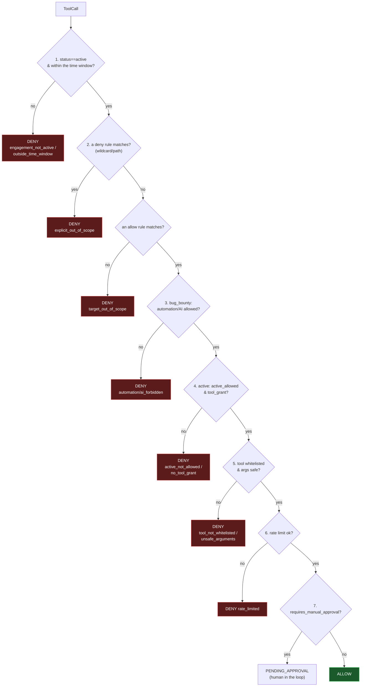
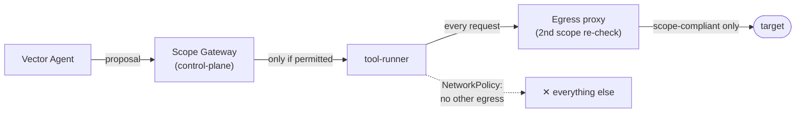

# Security Model

Source: [Technical Architecture Ch. 3](spec/technical-architecture.md#3-security-layer-the-scope-gateway) and [Deployment Architecture Ch. 1/5/6](spec/deployment-architecture.md).
The Scope Gateway is the service's actual intellectual property — not the
tool collection.

## Guiding principle: control lives in state, not in the prompt

No authorization depends on what the LLM "says" or how a prompt is phrased.
Exclusively signed DB state decides. A model that claims to be authorized
changes nothing.

## Scope Gateway: the decision pipeline

Deterministic (no LLM), stateless, **fail-closed**: the first rejecting
check ends the chain. Implemented in
[`control-plane/app/gateway/authorize.py`](../control-plane/app/gateway/authorize.py).

GitHub issue #32: a dedicated "bug_bounty: ident header configured?" step
used to sit here (step 7, denying `missing_ident_header`) - removed as dead
code once traced through: step 3 above already denies `bounty_program_missing`
whenever no `bounty_program` row exists for a bug_bounty engagement, and
REQ-AUTH-006's 2026-08-12 amendment made the header itself optional once a
program row exists (some real programs identify researchers out-of-band).
Header injection, when a program configures one, happens downstream in the
egress-proxy/worker, not as a gateway authorization gate.

**Deny precedence** (step 2) models bug-bounty programs' out-of-scope
lists, whose violation is a serious infraction. It's the core of the
[negative test](testing.md#the-negative-test-the-most-important-one).

## Defense in depth: two independent scope checks

The check happens deliberately **twice, redundantly**:

| Layer | Controls | Where |
|---|---|---|
| Scope Gateway | **what** gets commissioned | [`control-plane/app/gateway/`](../control-plane/app/gateway/) |
| Egress proxy | what actually **leaves** the network | [`egress-proxy/app/proxy.py`](../egress-proxy/app/proxy.py) |

Even if the gateway were bypassed, the NetworkPolicy blocks any traffic
that doesn't go to the egress proxy — and the proxy only lets
scope-compliant targets through. Two independent layers protect exactly
the point where an out-of-scope hit is most costly.

## Isolation boundary

Offensive tools (`tool-runner`) **never** run in the same container as the
gateway, the DB, or the audit log. If a tool breaks out or is compromised
(HexStrike has a documented history of misuse), it must not be able to
reach the control plane or the tamper-evident audit chain. The runner is
**ephemeral** — fresh per engagement, destroyed afterward — so no state
persists across customers/scopes.

## Two layers of tool restriction

Source: [`docs/spec/tool-allowlist.md`](spec/tool-allowlist.md).

1. **Build-time allowlist** ([`tool-runner/runner.Dockerfile`](../tool-runner/runner.Dockerfile))
   — what's installed in the image at all. A tool that's missing here can't
   be misused, regardless of any prompt. A build guard fails the build if
   an excluded tool (hydra, metasploit, sqlmap, masscan …) somehow ends up
   installed.
2. **Runtime grant** (`tool_grant` + `WHITELIST` in
   [`authorize.py`](../control-plane/app/gateway/authorize.py)) — which
   subset may be proposed in a specific engagement.

Additionally, [`args_safety.py`](../control-plane/app/gateway/args_safety.py)
hardens the arguments of even whitelisted tools (e.g. nmap only `-sV/-sS`,
no exploit NSE scripts; nuclei only `safe` templates).

For the exact flag-by-flag rationale of every static tool invocation (which
parameters, why exactly those values), see
[security/tool-catalog.md](security/tool-catalog.md) — written for an
external security researcher.

## Tool grants: passive, active, manual approval

The operator console separates three related but different decisions in the
Tool grants step:

| Control | Meaning | Enforcement |
|---|---|---|
| Passive | Allows OSINT/enrichment tools that query public or third-party data sources, such as certificate transparency or passive subdomain sources. It does not validate live services and is only useful where the registry has real passive tools. | Stored as `tool_grant(mode='passive')`; checked by the Scope Gateway together with the tool registry `execution_class == "passive"`. |
| Active | Allows target-touching tools in a category, but only after scope, time window, allowlist, and argument checks pass. | Stored as `tool_grant(mode='active')`; checked by the Scope Gateway. |
| Manual approval | Marks concrete active tools, such as `nmap` or `nuclei`, that must pause for an operator approval before execution. | Stored in `tool_approval_policy`; creates an `approval_request` when the otherwise-allowed call reaches the gateway. |

Manual approval is not a separate permission to run a category. If a category is
not active, selected tools in that category cannot run and no manual approval is
requested. The approval prompt only appears after the gateway has already
verified that the engagement is active, the target is in scope, the tool is
whitelisted, and the arguments are safe.

In the current capability registry, passive execution is available only for
recon tools such as `subfinder` and `amass`. Fingerprint, vuln, cred, and
exploit tools are target-touching in this build and therefore require active
permission when they are used.

## Audit trail: hash-chained and append-only

[`audit.py`](../control-plane/app/gateway/audit.py) writes every gateway
decision append-only, with `row_hash = sha256(prev_hash ||
canonical_json(row))`. The chaining makes after-the-fact modification
detectable — the proof to the customer, the bug-bounty operator, and the
professional-liability insurer that every action stayed in scope. In
production, the `audit_log` table gets its own backups and `REVOKE UPDATE,
DELETE` (INSERT only).

## Threat model (excerpt)

| Threat | Countermeasure |
|---|---|
| The LLM proposes an out-of-scope target | gateway deny/allow check (state, not prompt) |
| Prompt injection "I am authorized" | control lives in the DB, not in prompt text |
| Tool breakout / compromise | zone separation, ephemeral runner, NetworkPolicy |
| Gateway bypass | redundant egress proxy + NetworkPolicy (defense in depth) |
| out-of-scope network access | egress proxy blocks at the network level |
| after-the-fact audit tampering | hash chain, append-only, restrictive permissions |
| cost explosion / infinite loop | a budget ceiling per run (tool calls/tokens/time) |
| destructive exploitation | the build-time allowlist excludes exploit tools |
| lateral movement onto the execution engine (unauthenticated `/api/command`) | a shared-secret gate at the tool-runner (REQ-HARDEN-001, `X-ASM-Runner-Token`, fail-closed) |
| SSRF via an in-scope name to cloud metadata/loopback (DNS rebinding) | the egress proxy refuses link-local/loopback/reserved and pins the checked IP (REQ-HARDEN-002) |

A detailed, adversarial treatment of the "what if the Vector Agent goes
rogue and tries to break out of its boundaries" scenario (attack surface,
STRIDE scenarios, countermeasures, residual risk) is in
[`security/rogue-agent-threat-model.md`](security/rogue-agent-threat-model.md).

## Minimum safe-operation baseline

Public operator routes require the single-operator credential. Browser clients exchange the bearer credential for an HttpOnly, SameSite session cookie so SSE and protected downloads remain authenticated. `/health` is public; `/internal/*` continues to use the independent workload credential. Production mode rejects development credentials.

The egress proxy uses a read-only database role and submits bounded audit events to the authenticated control-plane ingestion route. If this audit submission is unavailable, the associated network request is denied. Audit appends take a PostgreSQL transaction advisory lock per engagement, producing one serialized hash chain.

Manual approvals use `requested -> approved -> executing -> consumed|execution_failed`. The claim transition re-runs the complete Scope Gateway against the stored call and is protected by a row lock.

## Raw scan target binding and truthful results

Raw-socket tools cannot traverse the HTTP proxy. In Compose, a run first obtains a bounded FIFO reservation; waiting grants no network access. The control plane then signs a short-lived capability only after the exact Nmap call passes the Scope Gateway. The separate raw-egress gateway requires the matching queue-head run, verifies the capability, and installs the audited materialized IP plus exact TCP or UDP ports in a deny-all namespace shared with the runner. The gateway, not the offensive runner, owns `NET_ADMIN`. One lease is active at a time; a heartbeat refreshes the kernel target timeout only while Nmap is running, and deactivation flushes both target and port sets. Kubernetes uses the equivalent per-engagement NetworkPolicy path. Each lease's granted packet rate is additionally enforced by a real kernel-level nftables `limit rate` rule scoped to the lease's concurrency slot (`raw-egress-gateway/app/gateway.py`'s `NftPolicyManager`) - not only by Nmap's own cooperative `--max-rate` flag (`docs/requirements/bounty-network-scan-profile.md`, `REQ-BOUNTYSCAN-004`).

For `bug_bounty`-source engagements, the raw-egress lease path additionally applies `docs/requirements/bounty-network-scan-profile.md`'s per-program `tcp_syn_scan_profile` tier (`none`/`common`/`full`, default `none`) on top of the Scope Gateway's own checks: only `host_discovery` (a fixed two-port liveness sweep) is exempted from the raw-nmap block by default; `common`/`full` are explicit, separate operator opt-ins, and `full` additionally requires a recorded `network_scan_authorization_evidence` reason - never inferred from `automation_allowed` or any rate figure alone. This is R4 (new active-scanning capability); a profile broader than `host_discovery` requires explicit human security review before use against a real (non-lab) program, per `AGENTS.md`'s documented-exception pattern.

Runner HTTP success is not treated as scan success. Non-zero exits, runner-declared failure, zero-target/malformed XML, policy/heartbeat/cleanup failure, and proxy backpressure are failed outcomes. TCP discovery covers exactly the persisted engagement range; service detection sees only discovered open ports. UDP is default-off, fixed to the approved nine-port profile, and persists open/closed/filtered/open-or-filtered counts while fingerprinting only confirmed-open ports. Tool, target/IP, protocol/range, state summary, stderr summary, and discovered-service count are stored in the append-only audit chain.

## Run-bound cancellation

Target-touching fingerprint and Vector-Agent calls carry an exact `scan_run_id`.
The Scope Gateway locks and verifies that run before authorization; cancelled,
foreign, inactive, or missing run context fails closed. The runner records the
ID as process ownership metadata (not permission), starts each command in its own
process group, and exposes only exact-run group termination to the worker. If the
control plane cannot answer a cancellation poll, the worker terminates the tool.
Raw Nmap retains its independently signed lease and revokes it in `finally` after
the runner returns or is terminated.
